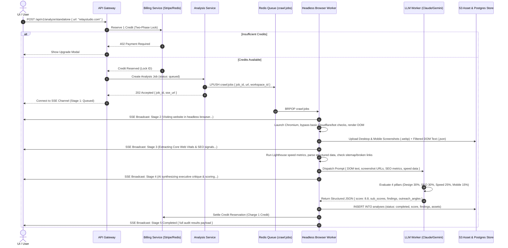
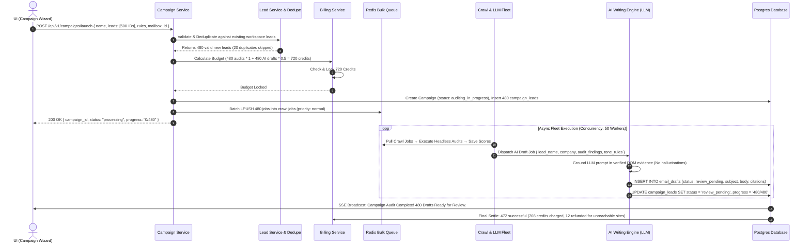
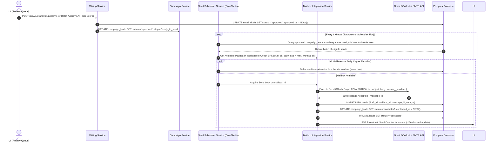
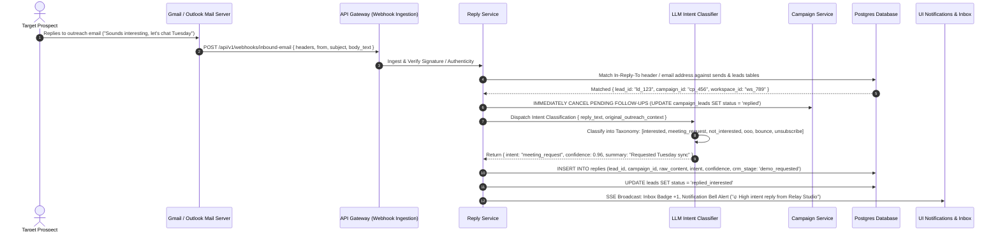
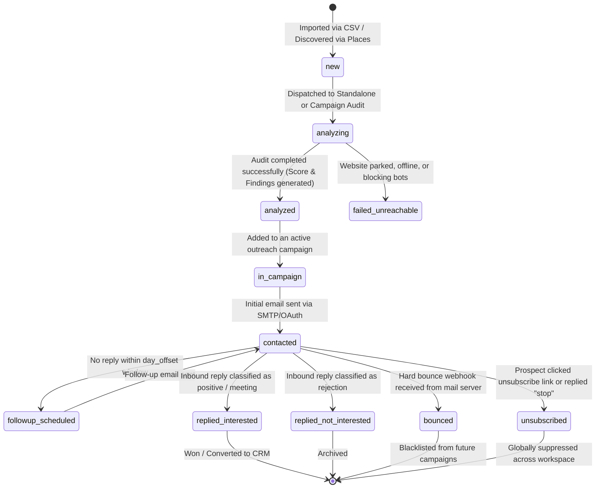

# Crawlia — System Architecture & End-to-End Execution Flow
**Master Wiring Diagram, Page-to-Service Topology, Lifecycle State Machines & Data Contracts**

---

## 1. Architectural Overview & Purpose

This document is the authoritative technical blueprint for **Crawlia**. While the [PRD.md](file:///g:/Clearpitch/PRD.md) defines *what* features to build and [DESIGN_GUIDE.md](file:///g:/Clearpitch/DESIGN_GUIDE.md) defines *how they look*, this document defines **how data flows end-to-end across every UI screen, API endpoint, background worker, database table, and external integration**.

Every user interaction in Crawlia follows a deterministic execution path. By mapping inputs, processing steps, queue dispatches, state transitions, and UI event broadcasts explicitly, we eliminate ambiguity for frontend, backend, and DevOps engineering teams.

---

## 2. Page-to-Service Wiring & Navigation Topology

Every UI screen in Crawlia connects to specific API Gateway routes, underlying backend microservices, real-time Server-Sent Event (SSE) channels, and caching layers.

| UI Page / Screen | Primary API Endpoints | Backend Services Involved | Real-Time Event Subscriptions (SSE) | Key Caching / Storage Layer |
| :--- | :--- | :--- | :--- | :--- |
| **1. Standalone Analyzer** (`/analyze`) | `POST /api/v1/analyze/standalone`<br>`GET /api/v1/analyze/{id}` | Analysis Service, Billing Service (Credits), Crawl Workers, LLM Workers | `sse:analysis:{id}` (stages 1–5 progress, live score streaming) | Redis cache (24h domain score TTL), S3 (screenshots, DOM text) |
| **2. Dashboard / Overview** (`/dashboard`) | `GET /api/v1/workspace/stats`<br>`GET /api/v1/campaigns/active`<br>`GET /api/v1/inbox/recent` | Workspace Service, Campaign Service, Reply Service | `sse:workspace:{id}:metrics` (live send/open/reply tick increments) | Redis KPI rollup cache (5m TTL), Postgres materialized views |
| **3. Leads & Prospects List** (`/leads`) | `GET /api/v1/leads`<br>`POST /api/v1/leads/import`<br>`POST /api/v1/leads/discover` | Lead Service, Places API Integration, Deduplication Engine | `sse:leads:import:{batch_id}` (import progress, duplicates skipped) | Postgres `leads` table, Elasticsearch / Postgres Full-Text Search |
| **4. Lead Detail View** (`/leads/{id}`) | `GET /api/v1/leads/{id}`<br>`GET /api/v1/leads/{id}/analyses`<br>`GET /api/v1/leads/{id}/drafts` | Lead Service, Analysis Service, Writing Service | `sse:lead:{id}:activity` | Postgres relational join (`leads` + `analyses` + `email_drafts`) |
| **5. Campaign List** (`/campaigns`) | `GET /api/v1/campaigns`<br>`POST /api/v1/campaigns`<br>`PATCH /api/v1/campaigns/{id}/status` | Campaign Service, Send Scheduler Service | `sse:campaigns:status` (running/paused state transitions) | Postgres `campaigns` table, Redis scheduler lock table |
| **6. Campaign Builder** (`/campaigns/new`) | `POST /api/v1/campaigns/draft`<br>`POST /api/v1/campaigns/{id}/estimate-credits`<br>`POST /api/v1/campaigns/{id}/launch` | Campaign Service, Lead Service, Billing Service, Analysis Service | None (synchronous REST validation during wizard steps) | Redis temporary wizard state (`draft_campaign:{user_id}`) |
| **7. Draft Review Queue** (`/campaigns/{id}/review`) | `GET /api/v1/campaigns/{id}/queue`<br>`POST /api/v1/drafts/{id}/approve`<br>`POST /api/v1/drafts/{id}/regenerate`<br>`PATCH /api/v1/drafts/{id}` | Writing Service, LLM Workers, Campaign Service | `sse:draft:{id}:regenerating` (streams new AI draft body in real time) | Postgres `email_drafts` table (optimistic locking on version) |
| **8. Unified Inbox** (`/inbox`) | `GET /api/v1/inbox/threads`<br>`POST /api/v1/inbox/{id}/reply`<br>`PATCH /api/v1/inbox/{id}/intent` | Reply Service, Mailbox Integration Service, LLM Intent Classifier | `sse:inbox:new_reply` (pushes incoming webhook replies instantly) | Postgres `replies` table, email thread indexing |
| **9. Analysis History** (`/history`) | `GET /api/v1/analyses/history`<br>`GET /api/v1/analyses/compare` | Analysis Service, Workspace Service | None (standard paginated REST queries) | Postgres `analyses` table index on `(workspace_id, completed_at)` |
| **10. Calendar View** (`/calendar`) | `GET /api/v1/schedule/calendar`<br>`PATCH /api/v1/sends/{id}/reschedule` | Send Scheduler Service, Campaign Service | `sse:schedule:updated` (reflects drag-and-drop reschedule across tabs) | Postgres `sends` and `follow_up_steps` time-bucketed indices |
| **11. Email Warmup** (`/warmup`) | `GET /api/v1/mailboxes/warmup`<br>`POST /api/v1/mailboxes/{id}/warmup/toggle` | Mailbox Integration Service, Third-Party Warmup Network API | `sse:warmup:stats` (daily reputation score and inbox placement updates) | Redis warmup status cache, external API sync |
| **12. Email Verification** (`/verify`) | `POST /api/v1/verify/batch`<br>`GET /api/v1/verify/jobs/{id}` | Lead Service, Third-Party Verification API (Bounceban/ZeroBounce) | `sse:verify:job:{id}` (real-time verification percentage counter) | Postgres `leads` table (`verification_status` column) |
| **13. Affiliate Dashboard** (`/referrals`) | `GET /api/v1/affiliates/stats`<br>`POST /api/v1/affiliates/payout` | Billing Service, Affiliate Tracking Engine (Rewardful/Stripe Connect) | None (cached affiliate link clicks and commission ledger) | Postgres `affiliate_ledger` table |
| **14. Settings & Billing** (`/settings/*`) | `GET /api/v1/workspace`<br>`POST /api/v1/billing/checkout`<br>`POST /api/v1/mailboxes/connect` | Workspace Service, Billing Service (Stripe), OAuth Provider Service | `sse:billing:balance_updated` (updates top header credit badge instantly) | Postgres `workspaces`, `mailboxes`, Stripe API sync |

---

## 3. End-to-End Core User Workflows

### Flow 1: Standalone Website Audit Loop ("The Aha Moment")
This is Crawlia's highest-converting acquisition loop and primary diagnostic tool.



#### Detailed Input/Output Specification for Flow 1:
*   **Input Payload (`POST /api/v1/analyze/standalone`):**
    ```json
    {
      "url": "https://relaystudio.com",
      "workspace_id": "ws_8f9a2b1c",
      "force_recrawl": false
    }
    ```
*   **Worker Execution Constraints:**
    *   Timeout: Maximum 35 seconds total (15s browser crawl + 5s asset upload + 15s LLM generation).
    *   Fallback Handling: If the domain fails to resolve (NXDOMAIN) or returns HTTP 5xx/404 after 2 retries, the worker marks the analysis as `status: failed_unreachable`, aborts the LLM step, and **automatically releases/refunds the reserved credit** in Billing Service.
*   **Output Payload (Stored in `analyses` table & sent via SSE Stage 5):**
    ```json
    {
      "analysis_id": "an_3e4r5t6y",
      "url": "https://relaystudio.com",
      "score": 8.8,
      "sub_scores": { "design": 9.2, "seo": 8.0, "performance": 8.5, "mobile": 9.5 },
      "assets": {
        "desktop_screenshot": "https://s3.crawlia.com/assets/relay_desktop_2026.webp",
        "mobile_screenshot": "https://s3.crawlia.com/assets/relay_mobile_2026.webp",
        "dom_snapshot": "https://s3.crawlia.com/assets/relay_dom_2026.json"
      },
      "findings": [
        {
          "pillar": "seo",
          "severity": "high",
          "title": "Missing XML Sitemap & OpenGraph Tags",
          "evidence": "No sitemap referenced in robots.txt or /sitemap.xml; og:image and og:description missing from <head>.",
          "outreach_hook": "When potential clients share your link on LinkedIn or Slack, it renders as a blank gray box without a preview image."
        },
        {
          "pillar": "performance",
          "severity": "medium",
          "title": "Uncompressed Hero Video Blocking LCP",
          "evidence": "Hero background video (/media/reel.mp4) is 14.2MB without lazy loading, delaying Largest Contentful Paint to 4.2s on 4G.",
          "outreach_hook": "Your hero reel looks stunning on desktop, but on mobile data it takes over 4 seconds to load, causing impatient visitors to bounce."
        }
      ],
      "suggested_angles": ["Lead with the missing social preview tags", "Pitch web performance optimization for their mobile traffic"],
      "completed_at": "2026-07-28T14:15:00Z"
    }
    ```

---

### Flow 2: Campaign Builder & Bulk Automated Outreach Loop
How Crawlia scales the audit-and-write loop across hundreds of target leads without overwhelming external APIs or user budgets.



---

### Flow 3: Draft Review, Sending & Mailbox Rotation Loop
The critical path where user approval turns into scheduled, deliverability-safe SMTP execution.



---

### Flow 4: Inbound Reply Ingestion & Intent Classification Loop
Closing the outbound loop by ingesting replies, stopping follow-ups, and sorting prospects by intent.



---

## 4. Master Lifecycle State Machines

To ensure data integrity, core entities in Crawlia operate as strict finite state machines. Transitioning between states requires specific triggers and validation checks.

### A. Lead Lifecycle State Machine (`leads.status`)



### B. Campaign Lead State Machine (`campaign_leads.status`)

| Current State | Trigger / Action | Target State | Required Validation / Condition |
| :--- | :--- | :--- | :--- |
| `queued` | Background worker picks up batch | `auditing` | Workspace credit balance ≥ required analysis credits |
| `auditing` | Analysis Service completes audit | `drafting` | Valid DOM and score returned; lead website accessible |
| `auditing` | Website unreachable / DNS error | `skipped_failed_audit`| Automatic credit refund triggered in billing ledger |
| `drafting` | LLM Writing Service generates email | `review_pending` | Draft contains ≥ 1 verified evidence citation from audit |
| `review_pending`| User clicks "Approve" (or auto-send rule matches) | `approved` | Mailbox assigned and sender domain DNS verified |
| `review_pending`| User edits draft text manually | `review_pending` | Creates new version in `email_drafts` table |
| `review_pending`| User clicks "Reject / Skip" | `skipped_by_user` | Removed from active sending queue |
| `approved` | Scheduler worker acquires send lock | `scheduled` | Current time is within campaign `send_window` (e.g., 9am-5pm EST) |
| `scheduled` | Mailbox Service receives 250 OK from SMTP | `sent` | Mailbox daily cap not exceeded; warmup limits respected |
| `sent` | Time passes == `followup_steps.day_offset` | `followup_due` | No reply received; lead status not in `[bounced, unsubscribed]` |
| `sent` / `followup_due` | Inbound reply webhook received | `paused_by_reply`| Immediate cancellation of all subsequent sequence steps |
| `sent` / `followup_due` | All campaign steps executed without reply | `completed` | Marked as finished in campaign reporting |

---

## 5. Critical Internal Data Contracts (JSON Schemas)

These schemas define the exact JSON structure passed between Crawlia's internal microservices.

### A. Redis Crawl Job Payload (`crawl:jobs`)
*Dispatched by API Gateway / Campaign Service → Consumed by Headless Browser Fleet.*
```json
{
  "$schema": "http://json-schema.org/draft-07/schema#",
  "title": "CrawlJobPayload",
  "type": "object",
  "required": ["job_id", "workspace_id", "url", "priority", "options"],
  "properties": {
    "job_id": { "type": "string", "format": "uuid" },
    "workspace_id": { "type": "string", "pattern": "^ws_[a-zA-Z0-9]+$" },
    "lead_id": { "type": ["string", "null"], "format": "uuid" },
    "campaign_id": { "type": ["string", "null"], "format": "uuid" },
    "url": { "type": "string", "format": "uri" },
    "priority": { "type": "string", "enum": ["high", "normal", "background"], "default": "normal" },
    "options": {
      "type": "object",
      "properties": {
        "capture_mobile": { "type": "boolean", "default": true },
        "run_lighthouse": { "type": "boolean", "default": true },
        "timeout_ms": { "type": "integer", "default": 25000 }
      }
    }
  }
}
```

### B. LLM Email Drafting Prompt Context (`LLMDraftPromptContext`)
*Dispatched by Writing Service → Consumed by Claude/Gemini LLM Workers.*
```json
{
  "$schema": "http://json-schema.org/draft-07/schema#",
  "title": "LLMDraftPromptContext",
  "type": "object",
  "required": ["lead", "audit_evidence", "campaign_rules"],
  "properties": {
    "lead": {
      "type": "object",
      "required": ["name", "company", "website_url"],
      "properties": {
        "name": { "type": "string", "example": "Sarah Jenkins" },
        "title": { "type": "string", "example": "Founder & Creative Director" },
        "company": { "type": "string", "example": "Relay Studio" },
        "website_url": { "type": "string", "example": "https://relaystudio.com" }
      }
    },
    "audit_evidence": {
      "type": "object",
      "required": ["overall_score", "top_critical_finding", "verified_hooks"],
      "properties": {
        "overall_score": { "type": "number", "example": 8.8 },
        "top_critical_finding": {
          "type": "object",
          "properties": {
            "pillar": { "type": "string", "enum": ["design", "seo", "performance", "mobile"] },
            "title": { "type": "string", "example": "Uncompressed Hero Video" },
            "raw_metric": { "type": "string", "example": "LCP is 4.2s on mobile data (14.2MB video payload)" }
          }
        },
        "verified_hooks": {
          "type": "array",
          "items": { "type": "string" },
          "example": [
            "Hero background video takes over 4 seconds to load on mobile devices.",
            "Missing OpenGraph social preview tags cause blank link shares on Slack/LinkedIn."
          ]
        }
      }
    },
    "campaign_rules": {
      "type": "object",
      "properties": {
        "tone": { "type": "string", "enum": ["direct_helpful", "peer_to_peer", "casual_consultative"], "default": "peer_to_peer" },
        "max_words": { "type": "integer", "default": 110 },
        "include_ps_line": { "type": "boolean", "default": true },
        "sender_value_prop": { "type": "string", "example": "We help boutique design agencies optimize their web vital scores and technical SEO in 1 week without changing their visual branding." }
      }
    }
  }
}
```

### C. Real-Time UI Broadcast Event (`RealtimeUIEvent`)
*Pushed via Server-Sent Events (SSE) from API Gateway → Consumed by Next.js Frontend Components.*
```json
{
  "$schema": "http://json-schema.org/draft-07/schema#",
  "title": "RealtimeUIEvent",
  "type": "object",
  "required": ["event_type", "timestamp", "workspace_id", "payload"],
  "properties": {
    "event_type": {
      "type": "string",
      "enum": [
        "analysis:stage_changed",
        "analysis:completed",
        "analysis:failed",
        "campaign:progress_tick",
        "draft:regenerated",
        "inbox:new_reply",
        "billing:credits_updated",
        "warmup:stat_tick"
      ]
    },
    "timestamp": { "type": "string", "format": "date-time" },
    "workspace_id": { "type": "string", "pattern": "^ws_[a-zA-Z0-9]+$" },
    "payload": {
      "type": "object",
      "description": "Dynamic payload structure matching the specific event_type (e.g., stage number, updated credit balance, or incoming reply snippet)."
    }
  }
}
```

---

## 6. Cross-Cutting Architectural Mechanisms

### A. Real-Time Communication Strategy (SSE vs. WebSockets)
Crawlia uses **Server-Sent Events (SSE)** over `GET /api/v1/events/stream` instead of WebSockets for all unidirectional real-time UI updates (audit stages, campaign progress ticks, incoming replies, and credit balance updates).
*   **Why SSE:** Unlike chat applications or collaborative whiteboards, Crawlia's real-time needs are almost entirely server-to-client (push notifications and progress meters). SSE operates over standard HTTP/2 and HTTP/3, requires zero custom handshake protocols, traverses corporate firewalls effortlessly, leverages native browser auto-reconnection (`EventSource`), and integrates cleanly with serverless and containerized load balancers without persistent memory socket bloat.

### B. Two-Phase Credit Ledger Settlement (Preventing Race Conditions)
To prevent credit leakage or double-spending when launching large campaigns, Crawlia implements a **Two-Phase Commit (2PC) Ledger Pattern** in Postgres (`workspace_credits_ledger`) backed by Redis atomic locks:
1.  **Phase 1: Reservation (Lock):** When a user requests 500 audits, Billing Service checks `credits_balance >= 500`. If true, it atomically writes a ledger entry with `type: 'reservation'`, `amount: -500`, and `status: 'locked'`. The user's available balance in the UI immediately drops by 500.
2.  **Phase 2: Settlement or Refund:** As the background worker fleet processes the 500 jobs, suppose 485 succeed and 15 fail (unreachable websites). Upon batch completion, Billing Service executes a single transaction: it updates the reservation to `status: 'settled'`, writes a final debit for `-485 credits`, and releases the remaining 15 credits back to the available balance with an audit log note (`type: 'refund_unreachable'`).

### C. Dead-Letter Queue (DLQ) & Anti-Bot Blocking Recovery
When Crawlia's headless Chromium workers encounter Cloudflare bot protection, CAPTCHAs, or geo-blocked enterprise firewalls:
1.  The worker catches the HTTP 403 / 503 Challenge response and immediately aborts standard DOM extraction.
2.  The job is moved to a secondary retry queue (`crawl:retry:stealth`) with an exponential backoff timer (e.g., 30s, 2m, 5m).
3.  The stealth queue routes the request through a rotating residential proxy network with enhanced TLS fingerprint spoofing.
4.  If the domain remains impenetrable after 3 attempts, the job is moved to `crawl:dlq`, the analysis is marked as `status: failed_bot_blocked` in Postgres, and a webhook/SSE alert notifies the user so they can manually inspect or skip the prospect without losing credits.
