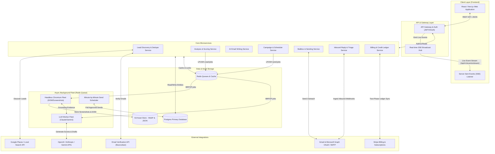
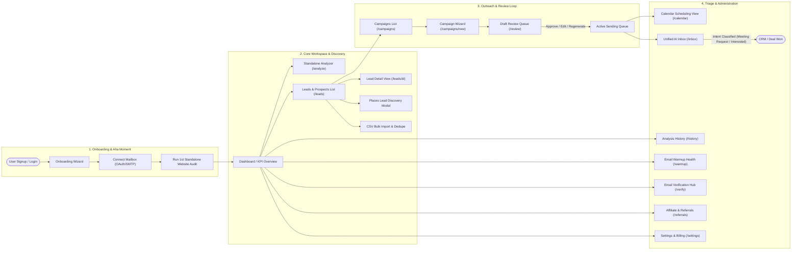
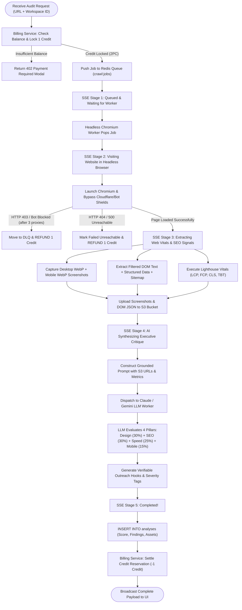
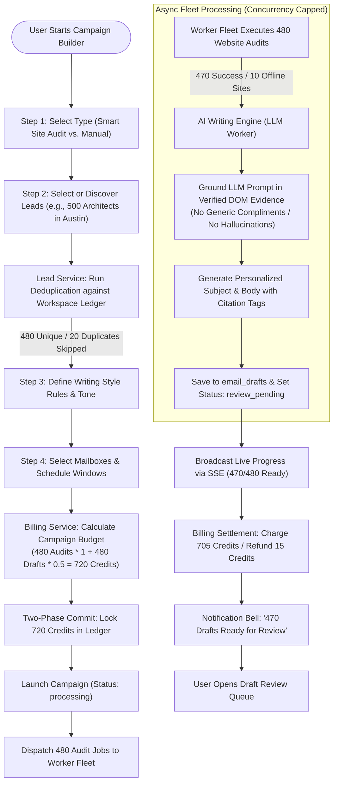
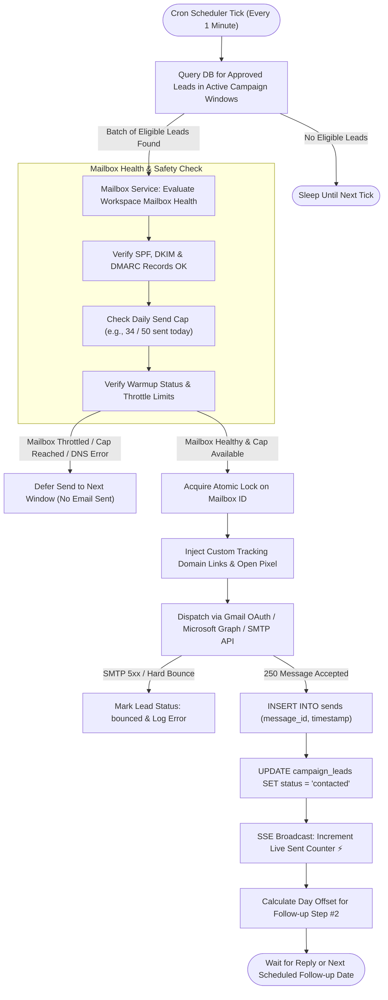
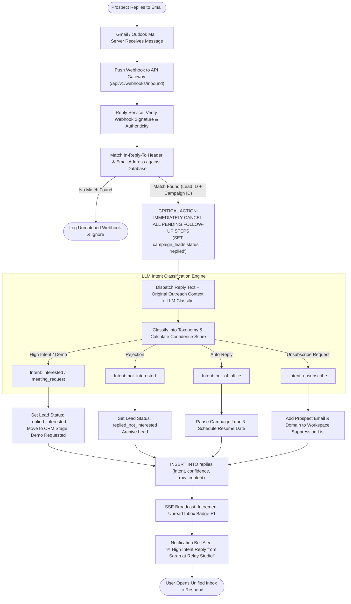
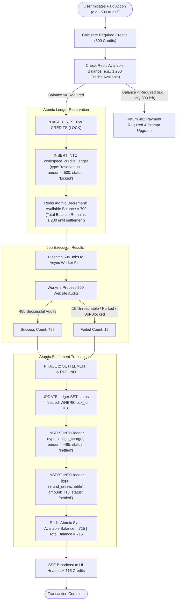

# Crawlia — Master Visual Flow Diagrams
**The Complete Architecture, Navigation, Execution Loops, and Lifecycle Flowcharts**

---

## 1. Master System Topology & Component Wiring
This diagram maps how every part of the Crawlia platform interconnects: from user interaction in the web browser down to external LLM providers and headless browser workers.

---

## 2. Master User Journey & Screen Navigation Flow
How a user navigates through Crawlia's 14 primary screens to go from zero leads to closed sales meetings.

---

## 3. The 5-Stage Website Crawl & AI Audit Flow (Standalone & Bulk)
This diagram illustrates what happens inside Crawlia's backend from the moment a URL is submitted until the final 4-pillar score is produced.

---

## 4. Bulk Campaign Setup & AI Email Generation Flow
How Crawlia automates lead discovery, bulk website auditing, and evidence-grounded email drafting across hundreds of prospects.

---

## 5. Smart Sending, Mailbox Rotation & Warmup Flow
The minute-by-minute execution cycle that ensures high deliverability, domain protection, and automated tracking.

---

## 6. Inbound Reply Ingestion & Intent Triage Flow
How Crawlia closes the outbound loop by ingesting replies, stopping follow-ups immediately, and categorizing prospect intent.

---

## 7. Two-Phase Commit (2PC) Credit Ledger & Refund Flow
How Crawlia manages credit balances atomically in Postgres and Redis without negative balances or race conditions.

