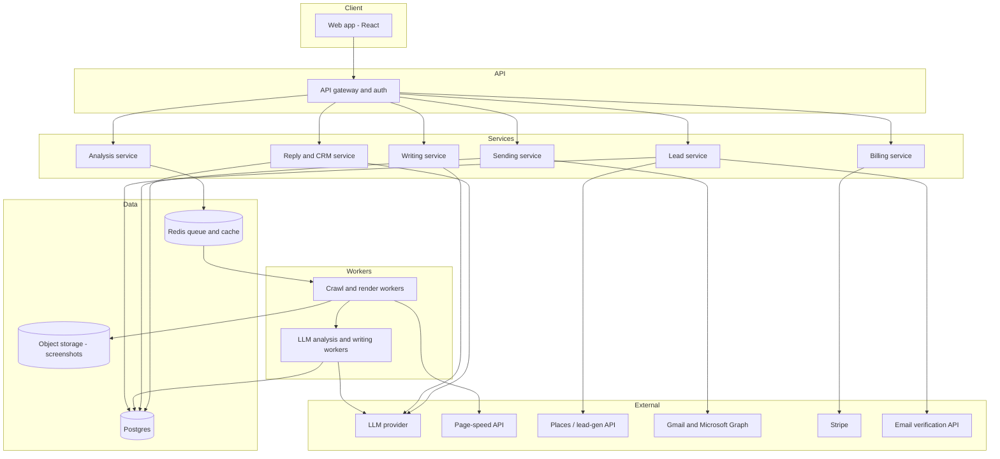
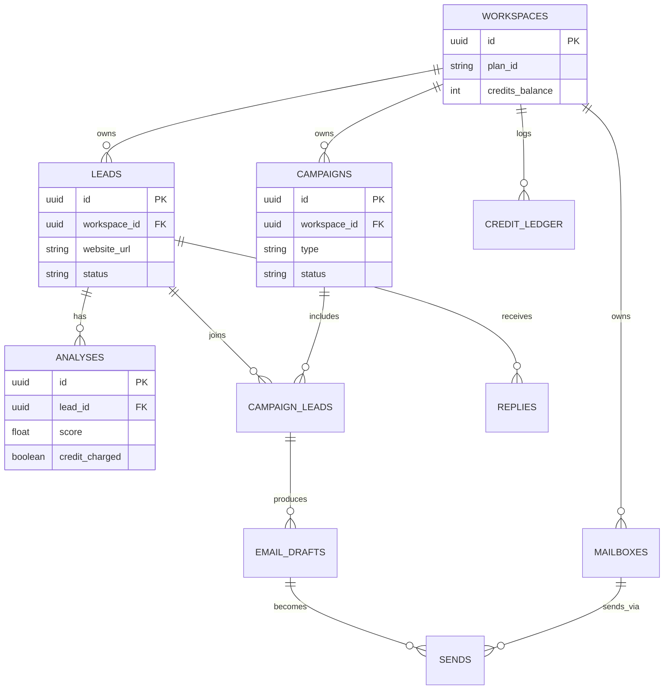

# Crawlia — Website Analysis & Outreach Automation Platform
### Product Requirements Document (PRD)

| | |
|---|---|
| **Version** | 1.0 (initial build spec) |
| **Status** | Ready for engineering scoping |
| **Owner** | Product |
| **Intended audience** | Development agency / engineering team building the v1 product inside Antigravity |
| **Last updated** | July 28, 2026 |

**How to use this document:** Sections 1–7 are product context — read once, refer back when a tradeoff call is needed. Section 8 (Functional Requirements) is the build backlog — each numbered sub-section is written to be liftable into its own ticket or its own Antigravity agent task with a clear "done" definition. Sections 9–18 are the cross-cutting engineering, security, and QA bar every feature must clear regardless of which sub-team builds it. Section 22 lists the decisions this document deliberately leaves open — resolve those before or during sprint 0, not after.

**Product name:** This document uses **Crawlia** as the final product name throughout. The name is a coined word derived from "crawl" (web crawling) — playful, memorable, and unique in the market.

---

## 1. Document control & purpose

This PRD defines the complete v1 (and near-term v2) scope for Crawlia, a SaaS platform that finds businesses, audits their live websites the way a senior designer, SEO consultant, and performance engineer would, and turns the specific problems it finds into individually personalized cold outreach emails — then sends, tracks, and triages the replies. It is written to remove ambiguity for whoever builds it: every functional requirement includes inputs, outputs, states, and edge-case handling, not just a feature name.

This is a **build specification**, not a pitch deck. Business goals and market framing are included only where they change engineering decisions (e.g., credit economics shape the analysis pipeline's cost budget).

## 2. Executive summary

Crawlia helps web agencies, freelance designers/marketers, and outbound teams stop choosing between **volume** and **relevance** in cold outreach. The user gives Crawlia a list of businesses (or asks Crawlia to find them); Crawlia opens each business's website in a real browser, scores it across design, SEO, performance, and mobile experience, and writes a short personalized email that references what it actually found — a slow homepage, a missing meta description, a contact form that doesn't work on mobile — instead of a generic "I noticed your website could use an upgrade" template. The email is reviewed (or auto-sent once trusted), tracked, and any reply is automatically sorted by intent so the user only spends time on real conversations.

The product has two core loops that must both work well: the **audit-and-write loop** (the analytical/AI core, and the actual product differentiator) and the **send-and-track loop** (commodity cold-email infrastructure that must simply be reliable and not damage the sender's deliverability). Section 8 treats these with proportionate depth — the audit-and-write loop gets the most detailed AI engineering spec in Section 13; the send loop leans on well-established patterns (Section 8.7).

## 3. Problem statement & market opportunity

**The problem:** Generic cold email reply rates have been declining for years because recipients can spot a template instantly. Manually researching every prospect's website to personalize an email doesn't scale past a handful of leads a day. Agencies and freelancers selling website-dependent services (redesigns, SEO, CRO, performance work, marketing) are stuck choosing between sending a lot of forgettable email or a little bit of good email.

**The opportunity:** A website's own flaws are a naturally provable, non-generic hook — "your contact form is broken on mobile" is a fact the recipient can verify by opening their own site, which is categorically more credible than a compliment or a guess. This category already has commercial validation: a comparable product (Swokei) markets itself specifically to web agencies around this exact mechanic — visit the site, score it, write from what was found — and cites reply-rate multiples of 3–4x over generic outreach as its core value claim. Adjacent categories (Instantly, Smartlead for high-volume sending; lemlist for manual personalization; Apollo and Clay for data enrichment) each solve part of the problem but not the specific "audit the actual live website, automatically, at scale" mechanic. Section 6 breaks this down further.

**Target market shape:** a large, fragmented, global population of small-to-mid web/digital agencies and solo freelancers, most under 20 people, most underserved by enterprise sales-engagement tools built for SDR teams rather than for people who are also the designer.

## 4. Goals, non-goals & success metrics

**Goals**
- Ship a working audit-to-outreach pipeline (Section 8.3–8.7) that produces emails a recipient would believe were hand-written, at a cost-per-analysis the business model in Section 19 can sustain.
- Reach feature and quality parity with the leading reference competitor on the core loop within two quarters of starting build, then differentiate on SEO-signal depth and lead-gen targeting (Section 6).
- Establish the credit-economics and deliverability foundations (Sections 8.10, 8.7, 14) correctly from v1, since retrofitting billing logic or sender-reputation practices after real customers are sending is materially harder than building them in from day one.

**Non-goals (explicitly out of scope through v2)**
- LinkedIn outreach, cold calling/dialer features, or SMS/WhatsApp channels.
- A general-purpose email marketing/newsletter product (this is a cold-outreach tool, not an ESP).
- Native mobile apps (responsive web only).
- Building a custom email-warmup seed network in-house for v1 — see the build-vs-buy call in Section 8.7.

**Success metrics (illustrative targets — calibrate with real cohort data after beta; do not treat as committed numbers)**
| Metric | Target | Why it matters |
|---|---|---|
| Activation rate (workspace runs its first analysis within 24h of signup) | ≥ 60% | Signals the aha-moment (seeing a real audit of a real site) is reached fast |
| Time from signup to first email sent | ≤ 30 minutes (self-serve) | Core activation friction indicator |
| Reply rate on Site Audit Outreach campaigns vs Manual Outreach campaigns (same workspace) | ≥ 2x uplift | Validates the core product thesis, not just the business model |
| Credit-to-successful-analysis ratio | ≥ 95% (i.e., <5% of charged credits come from analyses users later dispute) | Billing trust |
| Monthly logo churn (paid workspaces) | < 5% | Retention health |
| Sender domain blocklist incidents per 10,000 sends | 0 | Deliverability is existential — one bad incident can sink the whole workspace's inbox placement |

## 5. Target users & personas

**Persona A — "Agency Amir."** Runs a 3–8 person web design/dev studio. Needs a predictable stream of qualified leads without hiring a dedicated SDR. Comfortable with SaaS tools, not a developer. Cares about: consistent volume, not looking spammy to prospects who might become long-term clients, being able to tweak the pitch angle per niche (restaurants vs. law firms need different framing).

**Persona B — "Freelance Farah."** Solo freelance designer or marketer. Price-sensitive, time-constrained, wants the tool to do almost all of the outreach work so she can spend her hours on client delivery, not prospecting. Cares about: low cost per qualified conversation, not needing to learn complex campaign-builder logic, mobile-friendly review of drafts between client meetings.

**Persona C — "Growth Gabriel."** In-house growth/BDR lead at a larger marketing or SEO agency (20–100 people). Needs team seats, permissioning, reporting he can show leadership, and integration with the CRM the sales team already uses. Cares about: auditability (who sent what), pipeline reporting, not breaking the company's sending domain reputation.

Each persona maps directly to a pricing tier in Section 19 and should be used to prioritize which settings are exposed by default versus tucked behind "advanced."

## 6. Competitive landscape

| Product | Core angle | Where it's strong | Gap Crawlia should exploit |
|---|---|---|---|
| Swokei | Automated per-site design audit → personalized email, agency-specific, credit-based billing | Polished self-serve campaign builder; clean "only pay for the expensive step" credit model; strong fallback-handling for broken/parked sites | SEO signal depth is thin relative to its own marketing claims (design/UX-centric scoring, not real meta-tag/schema/sitemap analysis); lead-gen is a secondary feature, not a first-class local-business search; language coverage stops around 11–12, mostly European |
| Instantly | High-volume sending + mailbox warmup at a flat rate | Deliverability infrastructure, unlimited sending model | Personalization is manual/templated; no site-analysis layer at all |
| lemlist | Personalization via images/video/liquid syntax | Creative personalization primitives | Personalization is manual per lead, doesn't scale to hundreds of leads without human effort |
| Smartlead | Sending infrastructure, inbox rotation, deliverability | Infra reliability at scale | Same gap as Instantly — no automated site-understanding layer |
| Apollo / Clay | Contact/company data enrichment, workflow building | Data depth, integrations | Clay in particular requires heavy manual workflow setup per use case; neither audits the actual rendered website as the personalization hook |

**Crawlia's wedge:** go one layer deeper than "design score" into real SEO signals (structured data, sitemap, meta completeness, broken links) and real Core Web Vitals (not a single opaque number), pair it with a lead-gen module tuned for local/SMB discovery (not just enterprise contact databases), and keep the credit-economics model that Swokei has already proven the market accepts (Section 19). Do not try to out-build Instantly/Smartlead on raw sending volume or mailbox warmup networks — rent that capability (Section 8.7) and spend engineering effort on the analysis/writing engine, which is the actual moat.

## 7. Scope: MVP, v1, v2

**MVP (target: single core loop working end-to-end, manual-heavy, ~8–10 weeks of build)**
- CSV/Google Sheet import only (no built-in lead-gen yet)
- Crawl + audit: design/UX critique, real SEO signal extraction, PageSpeed-based performance, mobile viewport check
- 0–10 composite score
- LLM-drafted subject + body, human review/edit required before send (no auto-send)
- Single mailbox connection (Gmail OAuth only)
- Manual send, basic open/click tracking
- Simple reply inbox, manually triaged (no auto-classification yet)
- Single workspace, single user (no teams yet)
- Standalone single-URL analyzer ("Analyze a website" quick action — the aha-moment feature)
- In-app notification center (bell icon) for reply alerts and system events

**V1 (adds, target: +8–10 weeks)**
- Built-in lead-gen (local business search)
- Quality-threshold rules + fallback handling for unreachable/parked/no-website leads
- Follow-up sequences
- Multi-mailbox + Outlook/SMTP support
- Email verification
- Reply auto-classification
- Credit-based billing on Stripe, free tier + paid tiers
- Team workspaces with roles
- Calendar/scheduling view for send density management
- Analysis history page (chronological log of all workspace analyses)
- Email warmup integration as a first-class dashboard feature
- Email verification dashboard section with verified/unverified counts
- Global AI assistant (always-available in header, not just a support widget)
- Persistent credit balance display in global header
- Support ecosystem: tutorials, documentation, feedback portal, chat support as sidebar nav items
- Affiliate/referral dashboard (basic)

**V2 (adds, not detailed at the same depth in this document — directional only)**
- CRM with custom pipeline stages
- Deeper SEO module (structured data validation, broken-link crawl beyond sampling, sitemap diffing over time)
- Mailbox warmup (via rented capability, see 8.7)
- Multi-currency billing / localization
- Affiliate/referral program
- Additional output languages beyond the v1 set
- Public API + webhooks for agencies wanting to embed Crawlia in their own tooling

**Explicitly never in scope without a separate PRD:** LinkedIn/SMS channels, native mobile apps, a general ESP/newsletter product.


## 8. Functional requirements

Each sub-section below is written as an independent, ticket-sized unit: purpose, inputs/outputs, required states, and edge cases. Acceptance criteria are given as concrete pass/fail statements, not adjectives.

### 8.1 Authentication & workspace management

**Purpose:** every user belongs to one or more workspaces (a workspace = a billing entity = a team).

- Sign-up/login via email+password and Google OAuth.
- One workspace created automatically at signup; users can be invited into additional workspaces.
- Roles: **Owner** (billing, delete workspace, everything below), **Admin** (manage members, campaigns, mailboxes, cannot touch billing), **Member** (create/run campaigns and leads, cannot invite/remove members or touch billing).
- Invite flow: email invite with expiring token; seat count enforced against the plan limit (Section 19) at invite time, not just at billing time.
- Session handling: JWT access token (short-lived, ~15 min) + refresh token (long-lived, revocable); password reset via emailed time-limited link.
- 2FA (TOTP) available as an opt-in setting from V1, not required for MVP.

**Acceptance criteria:** a user cannot be invited past the seat limit of the current plan without first being shown an upgrade prompt; removing a member immediately revokes their session (no waiting for token expiry).

### 8.2 Lead management

**Purpose:** get businesses (name, contact, website) into the system, deduplicated, ready for analysis.

- **CSV import:** user uploads a file; system auto-detects columns (name, email, website, company, city, industry) using header-name heuristics, shows a mapping screen before commit, requires at minimum one of {email, website_url} per row to accept it. Unmapped columns are retained as `custom_fields` and become available as merge variables.
- **Google Sheets import:** OAuth-scoped read access to a specific sheet; one-time pull or "refresh" pull (V1); same mapping flow as CSV.
- **Built-in lead-gen (V1):** user searches by location + business category (e.g. "gyms in Jamshedpur"); backed by a places/business-directory API (Section 10); results are filtered server-side to only businesses that resolve to a live website domain (a business with no website is surfaced separately, tagged `no_website`, and routed to Manual Outreach per Section 8.6 rather than silently dropped).
- **Deduplication:** dedupe key = normalized root domain (strip protocol/www) OR exact email match, whichever is present; when a lead is re-imported, existing status/history is preserved, not overwritten.
- **Lead status lifecycle:** `new → queued → analyzing → analyzed → drafted → in_review → scheduled → sent → opened → clicked → replied → bounced → unsubscribed → excluded`. Status is a single source of truth surfaced identically in the leads table, the campaign view, and the lead detail view.
- **Bulk actions:** tag, delete, add-to-campaign, export-CSV, re-analyze.
- **Lead detail view:** shows full analysis findings, score breakdown, every draft version generated, the email thread if sent, and a chronological activity timeline.

**Acceptance criteria:** importing the same CSV twice does not create duplicate leads or double-charge analysis credits for leads already analyzed; a row with neither email nor website is rejected at import time with a clear reason shown to the user, not silently dropped.

### 8.3 Website analysis engine (core differentiator)

**Purpose:** given a URL, produce a structured, evidence-grounded audit without wasting credits on sites that can't meaningfully be audited.

**Stage 1 — cheap pre-check (no credit charged, must complete in under ~3 seconds):**
- DNS resolution check, HTTP status/redirect-chain resolution, TLS validity.
- Parked-domain heuristic (pattern-match against known registrar-parking page signatures).
- Bot-wall/CAPTCHA detection (response fingerprint match).
- If any check fails → lead is routed to the Rules/Fallback engine (Section 8.6) and no credit is consumed.

**Stage 2 — render (only runs if Stage 1 passes):**
- Headless Chromium (Playwright) opens the URL fully rendered — JS executed, fonts and images loaded — at both a desktop (1440×900) and mobile (390×844) viewport.
- Captures: full-page screenshot at both viewports, the rendered DOM/text content, total page weight, request count, console errors.

**Stage 3 — objective signal extraction (rule-based, no LLM, fast and cheap):**
- **SEO signals:** title tag present/length, meta description present/length, single/duplicate H1, image alt-text coverage %, canonical tag present, `schema.org` structured data present, `sitemap.xml` reachable, `robots.txt` reachable, HTTPS valid, a sampled set of internal links checked for 404s, mobile viewport meta tag present.
- **Performance signals:** call an external page-speed API for Core Web Vitals (LCP, INP, CLS), time-to-first-byte, total blocking time. This is a real, verifiable measurement — never approximate or LLM-guessed.
- **Tech-stack fingerprinting:** rule-based signature matching (generator meta tags, known JS globals/script paths, common CMS/e-commerce platform tells) — no AI needed for this, it is a solved pattern-matching problem.

**Stage 4 — design/UX/copy critique (LLM, the qualitative layer):**
- A single structured call sends: both screenshots, a summarized/truncated version of the rendered text content, and the Stage 3 signal summary (so the model critiques qualitatively rather than re-deriving facts it's already been given).
- Fixed rubric, matching the categories a senior designer would actually check: hero clarity, visual hierarchy, copy quality, mobile experience, trust signals, conversion-path clarity.
- Output is a validated JSON object: `{ category: { subscore: 0-10, findings: [string, ...] } }` per category. Findings must be traceable to something visible in the screenshot or extracted text — see the anti-hallucination guardrail in Section 13.

**Stage 5 — composite score (Section 8.4) and completion:**
- 1 credit is charged **only** once Stage 4 completes successfully. A site that fails at Stage 1 or 2 never reaches a charge.
- Job status (`queued/running/done/failed`) is tracked per lead and surfaced live in the UI.

**Realistic performance target:** a genuine multi-signal audit (render + page-speed API + LLM critique) should be budgeted at roughly 10–20 seconds end-to-end per site under normal load, not the sub-2-second figures sometimes seen in competitor marketing copy — those numbers typically reflect a cached or partial-signal fast path, not a full design+SEO+performance+LLM pass. Set the SLA and the credit-cost model against the realistic number, not the marketing one.

**Caching:** re-running analysis on a URL already analyzed within the last 14 days does not auto-recharge a credit; a lead-level "force re-analyze" action does, with a confirmation prompt showing the credit cost.

**Concurrency:** analysis jobs run through a queue with a worker pool sized to handle a full campaign (hundreds to low thousands of leads) submitted at once without falling over — see Section 10 for the queue/worker architecture and Section 9 for the specific throughput target.

**Standalone analyzer ("Analyze a website" quick action):** a global-level CTA — prominently placed on the dashboard and accessible from the header — that accepts a single URL and runs the full Stage 1–5 pipeline without requiring the URL to be part of a lead list or campaign. This is the product's primary aha-moment feature: a new user pastes any URL, sees a real audit in seconds, and understands the product's value before committing to imports or campaigns. Results are displayed inline with an option to "Save as lead" or "Add to campaign." This action consumes 1 credit like any other analysis. On the free tier, this is the recommended first action during onboarding.

**Acceptance criteria:** a parked domain, a domain returning only a CAPTCHA wall, and a domain timing out all reach the Rules engine with zero credits charged and a clear, distinct reason code surfaced to the user (not a generic "failed"). The standalone analyzer must be reachable in ≤ 2 clicks from any page in the app.

### 8.4 Website scoring engine

**Purpose:** turn the Stage 3/4 signals into one comparable 0–10 number per lead, so campaigns can be prioritized and filtered.

- Weighted formula, **not** a single LLM-invented number: Design/UX sub-score (35%) + SEO signal score (25%) + Performance/Core Web Vitals score (20%) + Mobile experience score (20%). Weights live in a config table, not hardcoded, so they can be tuned post-launch against real reply-rate data without a deploy.
- Score stored to one decimal place; sub-scores stored individually so the UI can render a breakdown (radar or stacked bar), not just the headline number.
- **Score history:** every analysis pass (including re-analyzes) appends to an immutable score-history log per lead, so an agency can show a prospect "your score three months ago vs. today" in a follow-up.
- **Re-score action:** available from the lead row; consumes a credit under the same rule as any other analysis (Stage 1 cheap-check still applies first).

**Acceptance criteria:** changing a weight in the config table and re-running the formula against stored sub-scores (no re-crawl) reproduces the new composite score correctly — i.e., sub-scores must be stored raw, not only the pre-weighted composite, or re-tuning is impossible without re-crawling everything.

### 8.5 Personalized email writing engine

**Purpose:** turn findings + lead data into a subject and body that reads like it was written by a person who spent five minutes on the site.

- **Inputs:** the 1–3 most severe findings from Section 8.3 Stage 4, lead fields (name, company, city, industry, any custom CSV column), and campaign-level writing settings (language, tone, signature block, closing CTA — e.g. "offer a free mockup," configurable per campaign).
- **Output:** one LLM call produces subject + body together (so the subject reflects what the body actually says, not a mismatched mail-merge line), returned as validated JSON `{ subject, body }`.
- **Merge fields:** `{{first_name}}`, `{{company}}`, `{{website}}`, `{{city}}`, `{{industry}}`, plus any custom-mapped column, resolved per recipient at generation time (not at send time, so the reviewer sees the real resolved text before approving).
- **Languages at launch:** English plus at minimum German, French, Spanish, Italian, Portuguese, Dutch, Polish, Swedish, Danish, Norwegian — this matches the coverage the market already expects from this category. Add Hindi as an explicit v1 differentiator given likely early adoption in the India/APAC agency market (flagged as an assumption in Section 22, not a firm commitment, pending target-market confirmation).
- **Regenerate:** a "different angle, same findings" action re-runs the writing call with an instruction to vary structure/opening line while citing the same evidence — must not silently pull in new, unverified findings.
- **Editing:** every draft is editable (plain text or light rich-text) before send; edits are versioned so the original AI draft is not lost if a user wants to revert.
- **Batch approve:** approve all remaining un-edited drafts in a campaign in one action; auto-send (skip review entirely) is an explicit opt-in toggle, off by default, and should only be recommended to a user once they've manually reviewed at least one batch — a UX nudge, not a hard gate, but the default must be review-required.
- **Guardrails:** hard body-length cap (~150 words), profanity/toxicity filter on generated output, and the evidence-grounding check described in Section 13 (a finding cited in the email must trace back to something the analysis actually extracted).

**Acceptance criteria:** disabling one finding category (e.g., "don't mention performance issues in emails") in campaign settings must be reflected in the next generation pass without the writer substituting an equivalent unlisted claim.

### 8.6 Campaign builder (rules, fallback, follow-ups)

**Purpose:** configure how a batch of leads gets turned into a running outreach campaign.

- **Campaign types:** `Site Audit Outreach` (runs the full Section 8.3–8.5 pipeline) and `Manual Outreach` (mail-merge only — for leads with no website, or for pitching services unrelated to the prospect's site).
- **Rules step** (Site Audit Outreach only): quality-threshold slider (skip/exclude leads scoring at or above the threshold — they're "too polished" to pitch a redesign to); unreachable-site rule (skip / send fallback / hold for manual review); no-website rule (skip / send fallback); parked-domain leads auto-skip by default, overridable.
- **Fallback template:** a separate subject+body template with its own merge fields, used only when a lead can't be analyzed but the user still wants a touch (e.g., "noticed your site seems to be down").
- **Follow-up sequence:** up to 5 steps, each with a day-offset from the initial send; any lead that replies is automatically paused from the remaining sequence (never double-messaged after a reply).
- **Campaign settings:** internal name (never shown to the recipient), subject template (with merge variables), assigned mailbox, send window (business hours + timezone), throttle (sends/hour), start date, optional end date.
- **Hold-for-review queue:** anything routed to "hold" by a rule lands in a dedicated review tab inside the campaign, separate from the main send queue, so a paused/held lead can never accidentally get swept into a send.

**Acceptance criteria:** changing the quality threshold after analysis has already run re-filters the existing campaign list without requiring leads to be re-analyzed.


### 8.7 Sending & deliverability

**Purpose:** get the approved email into the recipient's inbox from the user's own address, without wrecking their sender reputation.

- **Connect providers:** Gmail (Gmail API OAuth), Microsoft 365/Outlook (Microsoft Graph API OAuth), and generic SMTP (host/port/credentials/TLS) for any other provider.
- **Deliverability check on connect:** DNS lookup validating SPF, DKIM, and DMARC alignment for the connecting domain; surfaced as a clear pass/fail with a fix-it explanation, not a silent background check.
- **Multi-mailbox:** a workspace can connect several mailboxes; a campaign is assigned one, or rotates across several to spread volume (V1).
- **Throttling:** per-mailbox daily send cap, per-campaign hourly rate limit, and randomized jitter between individual sends so outbound traffic doesn't look machine-timed.
- **Tracking:** open pixel (toggleable per campaign — some users will disable it deliberately since pixels can themselves hurt spam scoring), link-click tracking via a redirect wrapper, bounce handling (parse provider bounce webhooks / NDRs into a normalized `bounced` status with reason), and a mandatory one-click unsubscribe link honored immediately (hard requirement, see Section 14).
- **Build-vs-buy call — mailbox warmup:** do **not** build an in-house seed-mailbox warmup network for v1. This is a solved, commoditized capability already offered by several dedicated providers via API. Integrate one as a pluggable warmup provider behind an internal interface, and spend the saved engineering time on Sections 8.3–8.5, which are the actual product differentiator. Revisit building in-house only if a v2 cost or reliability problem with the rented provider justifies it.

**Acceptance criteria:** a mailbox with a failing SPF/DKIM/DMARC check cannot be assigned to a live campaign without an explicit "send anyway" acknowledgment click; an unsubscribe click is reflected across every campaign in the workspace, not just the one the email came from.

### 8.8 Inbox, reply classification & CRM

**Purpose:** collapse "did anyone reply, and do they care" into a single triage view.

- **Unified inbox:** aggregates replies across every connected mailbox into one view, threaded against the original outbound email and lead record.
- **Intent classification (LLM):** every reply is classified into one of a fixed set — `interested`, `maybe_later`, `not_interested`, `wrong_person`, `out_of_office`, `unsubscribe_request` — with a confidence score; low-confidence classifications are routed to a "needs review" bucket rather than auto-filed, so a genuinely ambiguous reply never gets silently buried.
- **Suggested reply:** an LLM-drafted response the user can edit and approve before sending — never auto-sent without review.
- **Instant notification:** the moment a reply is classified `interested`, the assigned user gets an email + in-app notification — this is the single highest-value moment in the product and must never be delayed by batch processing.
- **CRM (MVP: simple; V2: custom stages):** MVP ships a fixed pipeline (`New → Contacted → Replied → Qualified → Won/Lost`) with notes and an activity log per lead; V2 adds custom stage naming per workspace.

**Acceptance criteria:** an `unsubscribe_request` classification automatically triggers the same suppression as a one-click unsubscribe link click — the two paths must converge on one suppression list, not two.

### 8.8.1 Analysis history

**Purpose:** provide a workspace-level chronological log of all website analyses, independent of the per-lead detail view.

- **Dedicated page** accessible from the main sidebar navigation (icon: clock/history).
- **Columns:** URL analyzed, lead name (if linked), composite score, status (completed/failed/pending), credit charged (yes/no), analysis date, action (view full report / re-analyze).
- **Filters:** date range, status (completed/failed), score range, credit-charged filter.
- **Sort:** newest first by default; sortable by score, date, URL.
- **Use cases:** auditing credit spend, revisiting past analyses without navigating through campaign → lead → analysis, spotting patterns in failed analyses (e.g., a specific domain always failing).

**Acceptance criteria:** every analysis triggered by any path (standalone analyzer, campaign pipeline, manual re-analyze from lead detail) appears in this log within 5 seconds of completion.

### 8.8.2 Calendar / scheduling view

**Purpose:** visualize and manage email send scheduling across all campaigns to prevent deliverability-damaging send density spikes.

- **Dedicated page** accessible from the main sidebar navigation (icon: calendar).
- **Monthly/weekly view** showing scheduled sends as events, color-coded by campaign.
- **Daily send density indicator:** a heatmap or bar showing total scheduled sends per day across all campaigns and mailboxes — flagging days that exceed recommended thresholds.
- **Drag-and-drop rescheduling (V2):** move a scheduled send to a different date/time.
- **Integration:** the campaign builder's "send window" and "start date" settings from Section 8.6 are reflected here; changing a campaign's schedule updates the calendar in real time.

**Acceptance criteria:** creating a new campaign with scheduled sends immediately shows those sends on the calendar; the calendar accurately reflects all pending sends across all active campaigns in the workspace.

### 8.9 Analytics dashboard

**Purpose:** answer "is this working" at a glance, at both the workspace and campaign level.

**Dashboard layout (target structure, derived from competitive reference):**

1. **Greeting banner:** personalized greeting ("Good morning, {name}"), workspace summary showing connected mailboxes count, active campaigns count, and current plan name.
2. **Four KPI cards (row):** Emails Sent (total), Interested Replies (count + "High intent" label), Running Campaigns (count + % change vs. previous period + "Active" label), Sites Analyzed (total).
3. **Send performance chart:** time-series line/area chart showing Sent, Opened, Bounced, and Clicked over a configurable period (default: last 30 days). Filterable by campaign ("All campaigns" dropdown) and time range.
4. **Split panel:**
   - *Left:* Recent Replies — latest 3–5 reply previews with "View all" link; empty state shows "No replies yet" with a "Send a campaign" CTA.
   - *Right:* Rate cards stacked vertically — Reply Rate (with progress bar), Open Rate (with progress bar), Unique Clicks (count), Bounced / Failed deliveries (count, red-highlighted if non-zero).
5. **Welcome / onboarding section:** for new or low-usage workspaces, shows a welcome card with sites-analyzed count and a prominent "🔍 Analyze a website" CTA button. Adjacent: "Recent analysis" panel showing latest analysis jobs with "View all" link.
6. **Mailbox health section:** three side-by-side cards:
   - Connected Mailboxes (count + "Manage" link)
   - Email Warmup (status: enabled/disabled, with enable CTA)
   - Email Verification (count verified + "Verify" CTA)

- **Campaign level:** funnel view (sent → opened → clicked → replied → interested), a daily activity time series, bounce/complaint rate flagged prominently (not buried — a rising complaint rate is an early warning the workspace is about to have a deliverability problem).
- **Export:** CSV export of any list/report view.

**Acceptance criteria:** every number shown on the dashboard must be reproducible from the underlying event tables via a documented query — no dashboard metric may exist only as a cached/derived value with no auditable source. The dashboard must load to first meaningful paint in under 2 seconds (Section 9).

### 8.10 Billing & credits

**Purpose:** make usage-based cost (mainly the LLM+browser-render cost of Section 8.3) transparent and unsurprising to the user.

- **Credit ledger:** every credit-consuming action (a completed website analysis, an email verification check) writes an immutable ledger row: `{ workspace_id, delta, reason, reference_id, balance_after, created_at }`. Balance is always derived by summing the ledger, never stored as a mutable counter alone — this is what makes a billing dispute auditable.
- **What costs credits vs. what's unlimited on any paid plan:** mirror the clean model the market has already validated — the compute-expensive step (website analysis, and email verification) is the only thing metered; Manual Outreach sending, the CRM, team seats, reply classification, and follow-up sequences are unlimited on any paid plan. This keeps the pricing story simple: you pay for audits, not for using the product.
- **Plans:** Free (one-time trial credit grant, no card required, capped feature set), and three paid tiers scaling credits/mailboxes/seats/lead-gen searches (illustrative numbers, not final — see Section 19).
- **Stripe integration:** subscription billing, proration on upgrade/downgrade, invoice history, dunning flow for failed payments (retry schedule + grace period before feature lockout, not instant lockout).
- **Top-up packs:** one-time credit purchases, valid for 12 months, stackable on top of the monthly plan allotment.
- **Usage alerts:** proactive notification at 80% and 100% of monthly credit allotment, with a one-click top-up or upgrade path — never a silent hard stop mid-campaign.

**Acceptance criteria:** summing the credit ledger for any workspace at any point in time must equal the balance shown in the UI at that time, exactly — this is tested as a reconciliation job, not just trusted.

### 8.11 Team / workspace & permissions

- Roles as defined in 8.1; a shared mailbox pool per workspace, with mailboxes assignable to specific campaigns regardless of who created the campaign.
- Audit log of consequential actions: who launched a campaign, who changed a billing plan, who connected/disconnected a mailbox, who exported a lead list.

**Acceptance criteria:** a Member role can never reach the billing page or the Stripe checkout flow, even via a direct URL — enforced server-side, not just hidden in the UI.

### 8.12 Settings & integrations

- Profile & signature block (used in email sign-offs and fallback templates).
- Connected accounts management: Google, Microsoft, SMTP, Google Sheets — each with a clear "connected as [email], last verified [date]" state and a disconnect action.
- Public API key management (V2).
- Notification preferences (email vs. in-app vs. both, per notification type).
- Data export and full account/workspace deletion — required for compliance (Section 14), must actually purge PII within a documented SLA, not just hide the record.

### 8.12.1 Email warmup management

**Purpose:** surface mailbox warmup as a first-class feature, not a hidden integration.

- **Dashboard widget** (see Section 8.9 layout item 6): shows warmup status per mailbox (Disabled / Active / Completed), with a toggle to enable/disable.
- **Warmup settings (per mailbox):** daily send ramp schedule (auto-recommended based on mailbox age), target warmup volume, warmup duration.
- **Status metrics:** warmup emails sent today, inbox placement rate during warmup, estimated days to full warmup completion.
- **Implementation:** delegate to a rented warmup provider via API (per Section 8.7's build-vs-buy decision); the UI is first-party, the engine is third-party.

**Acceptance criteria:** enabling warmup on a newly connected mailbox starts the warmup ramp within 1 hour; disabling warmup immediately pauses all warmup sends without affecting regular campaign sends.

### 8.12.2 Email verification dashboard

**Purpose:** bulk email verification as a visible workspace-level feature, not just a background credit-consuming action.

- **Dashboard widget** (see Section 8.9 layout item 6): shows count of verified emails, count of unverified emails, and a "Verify" CTA.
- **Verification actions:** verify all unverified leads in one click, verify per-campaign, verify individual lead.
- **Results:** each lead gets a verification status (valid / invalid / risky / unknown) stored on the lead record and visible in the lead table.
- **Credit consumption:** verification consumes credits at a lower rate than full website analysis (e.g., 0.1 credits per verification vs. 1 credit per analysis — exact ratio TBD, see Section 19).

**Acceptance criteria:** running bulk verification on 1,000 leads completes within 10 minutes; invalid emails are automatically excluded from campaign sends with a clear "email invalid" status.

### 8.12.3 Affiliate / referral dashboard

**Purpose:** enable organic growth through user referrals with transparent tracking.

- **Dedicated page** accessible from the sidebar footer.
- **Referral link generation:** unique per-user referral URL.
- **Tracking dashboard:** signups via referral, conversions to paid, commission earned (if applicable), payout history.
- **Rewards model (V1 suggestion):** credit-based rewards (both referrer and referee get bonus credits on signup + first payment) rather than cash commissions, to keep v1 simple.
- **Scope:** basic v1 ships the link generation + tracking dashboard; full commission/payout system is v2.

**Acceptance criteria:** a referral link click → signup → first paid conversion is tracked end-to-end and credited to the referrer within 24 hours.

### 8.13 In-app AI assistant

- **Global header button:** a prominently branded "🤖 Ask Crawlia" button in the top navigation bar, visible on every page — not a floating widget or a settings-buried chat. This is a primary interaction surface, not a support fallback.
- A lightweight, docs-grounded support chat scoped to product questions ("how do credits work," "how do I connect a mailbox," "what plans exist") — retrieval over the help-center content, not a general-purpose chatbot.
- **Context-aware suggestions:** on the campaign builder page, the assistant can suggest writing angles; on the analytics page, it can explain metric trends; on the lead detail page, it can summarize the analysis findings in plain language.
- Always shown with a plain-language disclaimer that it can be wrong and to double-check anything important — this is standard practice for this category and should not be treated as optional polish.

### 8.14 Notification center

**Purpose:** centralize all in-app notifications into a single, always-accessible panel.

- **Bell icon** in the top-right of the global header, with an unread-count badge (green dot or number).
- **Notification types (priority-ordered):**
  1. `interested_reply` — a reply classified as interested (highest priority, instant)
  2. `new_reply` — any other reply received
  3. `campaign_completed` — a campaign finished sending all scheduled emails
  4. `campaign_error` — a campaign hit an error (mailbox disconnected, etc.)
  5. `credit_warning` — 80% or 100% credit usage threshold reached
  6. `analysis_complete` — batch analysis job completed
  7. `team_activity` — member invited/removed, billing change
  8. `system_announcement` — maintenance, new features
- **Panel UI:** dropdown panel from the bell icon showing recent notifications, grouped by today/yesterday/earlier; each notification is clickable and navigates to the relevant page (e.g., clicking an interested_reply opens the inbox thread).
- **Mark as read:** individual and "mark all as read" actions.
- **Preferences:** per-type toggle for email vs. in-app delivery in Settings (Section 8.12).

**Acceptance criteria:** an `interested_reply` notification appears in the bell within 30 seconds of the reply being classified; clicking a notification navigates to the correct context page.

### 8.15 Global header elements

**Purpose:** define the persistent top navigation bar present on every authenticated page.

- **Left:** App logo + name.
- **Center/Right elements (left to right):**
  1. **Credits display:** lightning bolt icon (⚡) + current credit balance, always visible. Clicking opens the billing/credits page.
  2. **AI Assistant button:** branded "Ask Crawlia" button (Section 8.13).
  3. **User avatar + email:** dropdown with workspace switcher, account settings, logout.
  4. **Notification bell:** with unread badge (Section 8.14).

**Acceptance criteria:** credit balance in the header updates in real time (within 5 seconds) after a credit-consuming action completes.

### 8.16 Sidebar navigation structure

**Purpose:** define the persistent left sidebar navigation hierarchy.

- **Primary navigation (top section):**
  1. Dashboard (icon: grid/home)
  2. Campaigns (icon: paper plane)
  3. Leads (icon: people)
  4. CRM (icon: briefcase/building)
  5. Mailboxes (icon: envelope)
  6. Calendar (icon: calendar) — Section 8.8.2
  7. Inbox (icon: chat bubble, with unread badge)
  8. Analysis history (icon: clock) — Section 8.8.1

- **Footer section (secondary links):**
  1. Tutorials (icon: play/book)
  2. Documentation (icon: document)
  3. Feedback (icon: lightbulb/comment)
  4. Chat support (icon: chat)
  5. Affiliates dashboard (icon: external link) — Section 8.12.3

- **User section (bottom):**
  - User avatar + email + plan badge (e.g., "Free", "Growth")

**Acceptance criteria:** the active page is visually highlighted in the sidebar; the Inbox nav item shows an unread count badge that updates in real time.


## 9. Non-functional requirements

| Category | Requirement |
|---|---|
| API performance | p95 response time under 400ms for standard CRUD endpoints (leads, campaigns, settings) |
| Analysis throughput | Worker fleet must sustain at least 500 concurrent in-flight analysis jobs at launch scale, horizontally scalable by adding worker replicas, no architectural ceiling below that |
| Analysis latency | p95 end-to-end (queue → Stage 1–5 → persisted result) under 25 seconds per lead under normal load |
| Dashboard load | Under 2 seconds to first meaningful paint on the main dashboard |
| Availability | 99.9% uptime target for the core app (leads, campaigns, sending); public status page |
| Reliability | At-least-once processing for analysis and send jobs, with idempotency keys so a retried job can never double-charge a credit or double-send an email |
| Internationalization | Application UI in English at launch; generated-email output language is fully independent of UI language (Section 8.5) |
| Accessibility | WCAG 2.1 AA target for the web application |
| Browser support | Latest two versions of Chrome, Firefox, Safari, Edge |
| Data residency | EU customer data storage region flagged as an open question in Section 22 — do not assume US-only storage is acceptable without confirming target market |

## 10. System architecture

**Detailed execution flows & master visual diagrams:** For the comprehensive page-to-service topology, finite state machines, and internal JSON schemas, see [ARCHITECTURE_FLOW.md](file:///g:/Clearpitch/ARCHITECTURE_FLOW.md). For complete visual Mermaid flowcharts covering system topology, screen navigation, 5-stage audits, bulk campaigns, sending/warmup, reply triage, and 2PC credit ledger math, see [FLOW_DIAGRAMS.md](file:///g:/Clearpitch/FLOW_DIAGRAMS.md).

High-level shape: a web frontend talks to an API gateway, which fronts a set of focused services; the expensive, bursty work (rendering + LLM calls) runs on a separate async worker fleet behind a queue, never inline on the request/response path.



**Why this shape:** the crawl/render/LLM path is the only part of the system with unpredictable, spiky, expensive load (a single campaign launch can mean hundreds of leads hitting the queue at once). Isolating it as its own worker pool means it can be scaled and cost-monitored independently of the rest of the app, and a slow or failing analysis job never blocks the API from being responsive for everything else. The Sending service is kept separate from the Analysis service deliberately — sending has hard legal/deliverability constraints (throttling, unsubscribe honoring) that should not share failure modes with the analysis pipeline.

## 11. Data model / database schema

Primary store: Postgres. Core entities (columns abbreviated to the ones that matter for behavior; add standard `created_at`/`updated_at` to every table):

| Table | Key columns | Notes |
|---|---|---|
| `workspaces` | id, name, plan_id, credits_balance (derived, not authoritative — see 8.10), stripe_customer_id | One row per billing entity |
| `users` | id, email, password_hash, name | |
| `workspace_members` | workspace_id, user_id, role | Composite key; role = owner/admin/member |
| `leads` | id, workspace_id, name, email, website_url, company, city, country, industry, custom_fields (jsonb), status, source, dedupe_key | dedupe_key = normalized domain or email |
| `analyses` | id, lead_id, status, score, sub_scores (jsonb), findings (jsonb), screenshot_url, dom_text_url, performance_metrics (jsonb), seo_signals (jsonb), tech_stack (jsonb), credit_charged (bool), completed_at | One row per analysis pass — history is preserved, never overwritten |
| `campaigns` | id, workspace_id, name, type (site_audit / manual), status, rules (jsonb), language, subject_template, mailbox_id, send_window (jsonb), throttle, start_date, end_date | |
| `campaign_leads` | campaign_id, lead_id, status, current_step | Join table with its own state machine per Section 8.2 |
| `email_drafts` | id, campaign_lead_id, subject, body, version, approved_at, sent_at | Every regenerate/edit creates a new version, never overwrites |
| `follow_up_steps` | id, campaign_id, step_order, day_offset, template | |
| `mailboxes` | id, workspace_id, provider (gmail/outlook/smtp), email_address, oauth_token_encrypted, spf_ok, dkim_ok, dmarc_ok, daily_cap | Tokens encrypted at rest, see Section 14 |
| `sends` | id, email_draft_id, mailbox_id, sent_at, opened_at, clicked_at, bounced_at, bounce_reason | |
| `replies` | id, lead_id, campaign_id, raw_content, received_at, classified_intent, confidence, crm_stage | |
| `credit_ledger` | id, workspace_id, delta, reason, reference_id, balance_after | Append-only, see 8.10 acceptance criteria |
| `billing_subscriptions` | workspace_id, stripe_subscription_id, plan_id, status, renews_at | |



**Isolation:** every query-bearing table includes `workspace_id`; enforce row-level security (or equivalent application-layer guard) so a query scoped to one workspace can never structurally return another workspace's rows, even via a bug in a handler — this should be enforced at the data-access layer, not trusted to every call site individually.

## 12. API design

REST, versioned under `/v1`. Auth via bearer JWT, every token workspace-scoped. Representative endpoint set (not exhaustive — expand per-module as tickets are written):

```
POST   /v1/leads/import                 CSV/Sheet import, returns mapping preview
POST   /v1/leads/search                 Built-in lead-gen search
GET    /v1/leads/:id                    Full lead detail
POST   /v1/leads/bulk                   Tag / delete / add-to-campaign / export

POST   /v1/analyses                     Trigger analysis for one or more lead IDs
GET    /v1/analyses/:id                 Status + result

POST   /v1/campaigns                    Create campaign
POST   /v1/campaigns/:id/rules          Set quality-threshold + fallback rules
POST   /v1/campaigns/:id/start          Launch (validates mailbox deliverability first)
POST   /v1/campaigns/:id/pause
GET    /v1/campaigns/:id/analytics

POST   /v1/mailboxes/oauth/callback     Gmail/Outlook OAuth completion
POST   /v1/mailboxes/smtp               Add SMTP mailbox
GET    /v1/mailboxes/:id/deliverability  SPF/DKIM/DMARC check result

POST   /v1/emails/:id/regenerate
POST   /v1/emails/:id/approve
POST   /v1/emails/:id/edit

GET    /v1/replies
POST   /v1/replies/:id/classify         Manual override of an auto-classification

POST   /v1/billing/checkout-session
POST   /v1/billing/topup
POST   /v1/webhooks/stripe
POST   /v1/webhooks/gmail               Push notification for new replies
```

**Rate limiting:** per-workspace token bucket on all mutating endpoints, separate (tighter) limit on `/v1/leads/search` and `/v1/analyses` given their downstream cost. **Versioning:** additive changes only within `/v1`; breaking changes require `/v2` with a published deprecation window for `/v1`, not a silent behavior change.

## 13. AI/LLM engineering specification

This is the section that most directly determines whether the product feels magical or generic — treat it with the same rigor as the data model, not as a prompt-tweaking afterthought.

- **Model selection:** use a frontier multimodal model capable of accepting a screenshot plus text in a single call for the Stage 4 design/UX critique (Section 8.3) — this step needs real visual reasoning. A smaller/cheaper model is acceptable for the email-writing step (Section 8.5) and reply classification (Section 8.8), since neither requires vision reasoning at that depth; using a cheaper model there materially improves unit economics without hurting quality. Abstract every call behind an internal interface (`AnalysisModelClient`, `WritingModelClient`) so the underlying provider/model can be swapped without touching calling code — this is insurance against a single vendor's pricing or availability changes, not premature abstraction.
- **Prompt architecture:** system prompt encodes the fixed rubric (categories, scoring guide, required JSON output schema); the user turn carries the screenshots, a summarized/truncated version of the extracted page text (not the full raw DOM — truncate and pre-summarize to keep context cost bounded), and the already-computed Stage 3 objective signals, so the model is asked to critique qualitatively rather than re-derive facts it has already been handed.
- **Structured output:** enforce the JSON schema at the API level (structured-output/tool-calling mode, not "please respond in JSON" in prose); validate server-side before persisting; on a schema-validation failure, retry once with the validation error appended to the prompt, then fail the job cleanly (routes to a "needs manual review" state, never silently persists malformed data).
- **Cost/latency budget:** set and monitor a fixed target cost-per-analysis (in fractional-cent terms) that the credit price point in Section 19 must comfortably cover with margin; log token usage per call into the observability stack (Section 15) so a prompt change that quietly increases cost is caught before it erodes margin at scale.
- **Anti-hallucination guardrail:** the prompt instructs the model that every finding must be traceable to something actually visible in the screenshot or present in the extracted text — no invented statistics, no assumed facts about the business. A lightweight automated post-check flags any generated email sentence that references a specific claim (a number, a named page, a named competitor) not traceable to the stored findings, routing it to manual review rather than auto-sending it. This matters because a fabricated observation in a cold email ("I noticed your Q3 traffic dropped 40%" when nothing like that was ever measured) is not just an accuracy problem — it actively damages the sender's credibility with a real prospect.
- **Evaluation set:** maintain a held-out set of roughly 200 real, manually-graded websites (spanning good/bad/broken/parked examples) used to regression-test any prompt or model change before it ships — track correlation between model-assigned scores and human-rater scores over time as the core quality metric for this system, not just "does it still return valid JSON."
- **Reply classification:** single-label classification over the six fixed intents in Section 8.8; low-confidence outputs (below a tuned threshold) route to manual review rather than being auto-filed — silently misfiling a genuinely interested reply as "not interested" is one of the most damaging failure modes in the whole product, worth erring conservative here.


## 14. Security, privacy & compliance

- **OAuth token security:** Gmail/Outlook tokens encrypted at rest via a managed key-management service, scoped to the minimum OAuth scopes required (send + reply-detection read access — never request full-mailbox read access).
- **PII handling:** lead data (names, emails) is personal data under GDPR and similar regimes; support data-subject access and deletion requests end-to-end (Section 8.12), and have a data-processing-agreement template ready before onboarding any EU-based customer.
- **Cold-email compliance guardrails (not exhaustive legal advice — have counsel review before scaling send volume in any specific jurisdiction):**
  - Mandatory, immediately-honored one-click unsubscribe on every send (Section 8.7).
  - Clear sender identification: a real reply-to address and a registered business address in the footer, consistent with CAN-SPAM-style requirements.
  - Throttling and pacing (Section 8.7) both for deliverability and to avoid patterns that read as bulk/spam under most regimes.
  - Rules differ meaningfully by jurisdiction (CAN-SPAM in the US, UK GDPR/PECR, EU GDPR, India's IT Act and the incoming DPDP framework, among others) — the product should surface a jurisdiction-aware compliance checklist to the sender at campaign-launch time rather than the platform silently deciding what's legal for them; this is a UX/legal-education feature, not a guarantee.
- **Signup abuse prevention:** an IP-intelligence check (VPN/datacenter/proxy detection) gates automatic free-credit grants; flagged signups route to a manual review queue rather than an instant block, so legitimate users on a VPN aren't locked out, just delayed a few hours with a clear in-app explanation.
- **Secrets management:** all API keys and credentials live in a secrets manager, never in repo config or plain environment files committed to source control; rotated on a defined schedule.
- **Access control:** enforced server-side per Section 11's isolation requirement; no permission check should ever live only in the frontend.
- **Vulnerability management:** dependency scanning on every CI run, a third-party penetration test before the first public (non-beta) launch, and a published responsible-disclosure policy (`security.txt`).

## 15. DevOps, infrastructure & environments

- **Environments:** local, staging, and production, with infrastructure defined as code so staging is a true parity environment, not an afterthought.
- **Hosting:** containerized services on a managed container-orchestration platform; the headless-browser worker pool (Section 8.3, resource-heavy and bursty) runs in its own autoscaling pool, isolated from the API pods so a render-heavy campaign launch never starves normal API traffic.
- **CI/CD:** automated test suite gates every pull request; production deploys use a staged rollout pattern (canary or blue/green), never a single-shot full deploy.
- **Observability:** structured logging and distributed tracing across the full analysis pipeline (crawl → objective signals → LLM critique → score → write), with dashboards for queue depth, LLM latency and per-call cost, and send success rate; alerting on SLA breaches defined in Section 9, not just on hard crashes.
- **Backups & recovery:** automated daily Postgres backups with point-in-time recovery; a lifecycle policy on screenshot/object storage to auto-expire old assets and control cost; documented disaster-recovery targets (illustrative: RPO ≤ 1 hour, RTO ≤ 4 hours for core transactional data).
- **Cost controls:** per-workspace and global spend caps/alerts specifically on LLM and third-party API usage (Section 13) — this is the line item most likely to spike unexpectedly from a bug, a prompt regression, or abuse, and needs a hard ceiling, not just a dashboard someone checks occasionally.

## 16. QA & testing strategy

- **Unit tests:** all pure business logic — the scoring formula (Section 8.4), the credit-ledger math (Section 8.10), and the rules/fallback engine (Section 8.6) — must have unit coverage sufficient to safely re-tune weights or thresholds without manual re-verification each time.
- **Integration tests:** each external integration (LLM provider, page-speed API, Gmail/Outlook, Stripe, email verification) tested against sandbox/mocked accounts in CI, with a smaller set of real-sandbox contract tests run before each release to catch upstream API changes.
- **End-to-end tests:** the full critical path — import leads → analyze → draft → review → send → track → classify a reply — run against a staging environment with real (test) mailboxes on a schedule, not only on release day.
- **Load testing:** simulate a large campaign (thousands of leads submitted at once) against the analysis pipeline before any capacity milestone, to validate the throughput target in Section 9 under realistic burst conditions, not just steady-state load.
- **Deliverability testing:** seed-inbox placement testing across the major providers (Gmail, Outlook, Yahoo) before and after any change to sending infrastructure — a regression here is invisible in normal QA but devastating in production.
- **Sandbox mode:** QA (and prospective customers in a demo) should be able to run the full pipeline against a small set of fixture websites without consuming real credits or hitting real third-party APIs, so testing doesn't become a cost center.
- **Bug severity/SLA:** sending or billing correctness bugs are P0 (same-day fix); analysis-quality regressions are P1; cosmetic issues are P2/P3 — this triage hierarchy should be agreed before the first release, not improvised during an incident.

## 17. UX/UI requirements & key screens

**Design system & UI tokens:** For the exact color palette (deep teal & forest green, with an alternative sky & sapphire theme), typography hierarchy (Outfit + Plus Jakarta Sans + Instrument Serif), component styling, and Tailwind CSS configuration, see the dedicated companion guide at [DESIGN_GUIDE.md](file:///g:/Clearpitch/DESIGN_GUIDE.md). The interface applies the Swokei structural design formula to a fresh "AI Authority & Web Intelligence" aesthetic: clean, tactile, and high-contrast, designed for information density so users can review dozens of AI-generated drafts in a row without visual fatigue. Responsive down to tablet width is sufficient — this is a desktop-first, agency-user product.

**Global layout pattern:** every authenticated page follows a consistent shell:
- **Left sidebar** (fixed, ~220px): primary navigation per Section 8.16, collapsible to icon-only on narrow viewports.
- **Top header bar** (fixed): global elements per Section 8.15 (credits, AI assistant, user, notifications).
- **Main content area:** page-specific content with a consistent page title + subtitle pattern (e.g., "Dashboard / Overview of your workspace").

Key screens (each needs its own detailed wireframe pass before build, not specified pixel-by-pixel here):
- **Onboarding:** connect a mailbox or skip, import or generate a first small lead batch, run one real analysis (via the standalone analyzer CTA) before asking for a credit card.
- **Dashboard:** the Section 8.9 layout (greeting → KPIs → chart → replies/rates → onboarding/recent → mailbox health), with a clear next action ("3 drafts waiting for review").
- **Leads list + detail:** filterable/searchable table (Section 8.2) with:
  - **Summary KPI cards** at top: Total Leads, In Campaigns, Not in Campaigns, Opened (total opens across all leads).
  - **Filter bar:** two dropdown filters (status, campaign) + search input + "Bulk actions" dropdown + lead count.
  - **Lead rows:** each row shows Name/Email (primary), email address (secondary), website URL (tertiary), Company, Campaign badges, Status badge (user-facing label, e.g., "not contacted" for internal status `new`), Date added.
  - **Actions:** + Import button (prominent, green), Refresh button.
- **Campaign list:** filterable table with:
  - **Summary KPI cards** at top: Total Campaigns, Running ("Sending now"), Drafts ("Not started"), Completed ("Finished sending").
  - **Filter tabs:** All | Running | Created | Draft | Paused | Completed — each with a count.
  - **Campaign rows:** Name, Status badge (Draft/Running/Paused/Completed), Type badge ("Smart Outreach" = Site Audit Outreach, or "Manual"), Leads count, Created date, Continue/View action.
  - **Actions:** + New Campaign button (prominent, green), Search campaigns.
- **Campaign builder:** a step-by-step wizard mirroring Section 8.6 (type → leads → writing style → rules → review/start), each step independently completable and resumable as a draft.
- **Draft review queue:** the highest-friction, highest-value screen in the product — must support fast keyboard shortcuts for approve/edit/regenerate/skip across a batch.
- **Calendar:** the Section 8.8.2 scheduling view.
- **Inbox:** unified thread view with intent-classification tags (Section 8.8) visually prominent, with unread badge in sidebar.
- **Analysis history:** the Section 8.8.1 chronological log.
- **Analytics:** the Section 8.9 views.
- **Settings/Billing:** connected accounts, team members, plan/credits, invoices.

Accessibility: keyboard navigation and visible focus states throughout, sufficient color contrast on all status tags (a colorblind user must still be able to distinguish "interested" from "not interested" without relying on color alone — pair color with text/icon).

## 18. Analytics, growth & experimentation

- **Event tracking plan (minimum set):** `signup`, `first_lead_imported`, `first_analysis_run`, `first_campaign_launched`, `first_email_sent`, `first_reply_received`, `plan_upgraded`, `workspace_churned` — each with a documented schema so product analytics doesn't require reverse-engineering raw logs later.
- **Activation metric:** defined explicitly in Section 4 — instrument it from day one, don't retrofit.
- **Experimentation:** A/B testing capability on the onboarding flow and pricing page is a V2 capability, not MVP — but the event schema above should be designed now so it doesn't need to be redone to support experimentation later.
- **Referral/affiliate program:** a V2 growth lever, consistent with what comparable products in this category already run; not required for MVP launch.


## 19. Monetization & pricing model

Illustrative starting point only — validate against real cost-per-analysis data from Section 13 before finalizing, and treat every number below as a hypothesis to test, not a committed price list.

| Plan | Price (illustrative, monthly, billed annually) | Credits/mo | Mailboxes | Seats | Lead-gen searches/mo |
|---|---|---|---|---|---|
| Free | $0 | 20 one-time, no card | 0 | 1 | 0 |
| Starter | ~$39 | 2,000 | 1 (+add-on) | 2 | 200 |
| Growth | ~$79 | 5,000 | 3 (+add-on) | 5 | 1,000 |
| Agency | ~$199 | 12,000 | 5 (+add-on) | 10 | 5,000 |

- **Credit top-ups:** one-time packs at a mild volume discount (e.g., larger packs cost slightly less per credit than smaller ones), valid 12 months.
- **What's metered vs. unlimited:** per Section 8.10 — only website analysis and email verification consume credits; sending, CRM, team seats, reply classification, and follow-ups are unlimited on any paid plan. Sending itself is a paid-plan-only capability, not available on Free.
- **Currency/localization (open question, see Section 22):** default to USD for a global launch; if early traction concentrates in a specific region (e.g., India/APAC), a localized-currency tier and a local payment gateway become a near-term V1.5 consideration, not a v1 requirement — do not build multi-currency billing speculatively before there's a signal it's needed.

## 20. Rollout plan & milestones

| Phase | Scope | Illustrative duration |
|---|---|---|
| Phase 0 — Internal alpha | Team dogfoods the MVP loop on real prospect lists (including the team's own outbound, if applicable) | 2–3 weeks |
| Phase 1 — Closed beta | 20–50 design-partner agencies/freelancers on the MVP scope (Section 7), tight feedback loop, no self-serve billing yet | 4–6 weeks |
| Phase 2 — Public launch | V1 scope complete, self-serve billing live, public launch push (content/SEO, communities, a launch-day push) | Launch date set once V1 acceptance criteria across Section 8 are met, not a fixed calendar date |
| Phase 3 — V1 hardening + paid conversion | Focus shifts to conversion/retention metrics from Section 4 rather than new features | Ongoing |

## 21. Risks & mitigations

| Risk | Mitigation |
|---|---|
| LLM cost overrun (a prompt or model change quietly increases cost per analysis) | Hard per-analysis cost budget with alerting (Section 13, 15); abstracted model interface so a cheaper/faster model can be swapped in quickly |
| Deliverability/spam incident damages a customer's sending domain | Throttling, SPF/DKIM/DMARC enforcement before allowing sends, rented warmup capability (Section 8.7), seed-inbox testing (Section 16) |
| Legal/compliance exposure from cold-email regulation | Mandatory unsubscribe + sender ID (Section 14), jurisdiction-aware checklist, counsel review before scaling into a new market |
| Headless-browser fragility (sites blocking bots, CAPTCHA walls, JS-heavy edge cases) | The Stage 1/Rules fallback engine (Sections 8.3, 8.6) turns failures into a handled, credit-free state rather than a silent break |
| A generated finding is hallucinated and damages the sender's credibility with a real prospect | Evidence-grounding guardrail and post-generation check (Section 13); review-required-by-default before send (Section 8.5) |
| Competitive response (an incumbent adds a similar audit feature) | Compete on SEO-signal depth and local/SMB lead-gen (Section 6) rather than trying to out-spend incumbents on raw sending volume |
| Building the Antigravity task breakdown too coarse, producing agent output that doesn't match this spec | Break each Section 8 sub-section into its own agent-sized task with the stated acceptance criteria as the literal definition of done (Section 22) |

## 22. Assumptions & open questions

Resolve these before or during sprint 0 — each has a real, non-trivial downstream effect on the build:

1. **Target geography/currency:** is v1 global-first (USD, English-first with the language list in 8.5) or India/APAC-first given the founding team's home market? This affects payment gateway choice, initial language priority, and go-to-market — not just a pricing-page label.
2. **Model vendor choice:** which LLM provider(s) for Stage 4 critique vs. writing/classification — pending a cost/quality bake-off referenced in Section 13; the abstraction layer means this doesn't block starting the build, but it should be settled before optimizing prompts for a specific model's quirks.
3. **Auto-send default:** confirmed off-by-default per Section 8.5 — should there be a fast-track "trusted sender" path after N successful manually-reviewed batches, or should review always be a manual toggle?
4. **Antigravity task decomposition:** this PRD is written to be handed to an agentic build workflow — recommend a sprint-0 pass that turns each Section 8 sub-section into an individually scoped, independently testable task/ticket with its stated acceptance criteria as the literal Definition of Done, rather than feeding the whole document as one task.
5. **Self-serve-only vs. assisted onboarding:** does Phase 1 (Section 20) include white-glove onboarding for design partners, or is even the beta fully self-serve?

## 23. Appendix: glossary

- **Credit:** the unit of usage consumed by a completed website analysis or an email verification check (Section 8.10); the only metered actions in the product.
- **Workspace:** the billing and team entity; one or more users, one subscription, one shared mailbox pool.
- **Lead:** a business record (name, contact, website) that can be analyzed and/or contacted.
- **Site Audit Outreach:** the flagship campaign type that runs the full analyze-and-write pipeline (Section 8.3–8.5).
- **Manual Outreach:** the mail-merge-only campaign type, for leads with no website or unrelated offers.
- **SPF / DKIM / DMARC:** DNS-based email authentication standards that must be correctly aligned on a sending domain for deliverable, spam-folder-avoiding outbound email.
- **Warmup:** the practice of gradually ramping a new mailbox's sending volume (often via reciprocal sending/opening with seed accounts) to build sender reputation before full-volume use.

---

*End of document. This PRD is intentionally structured so Section 8 can be lifted sub-section by sub-section into individual Antigravity agent tasks or development-agency tickets, each with its own acceptance criteria as the definition of done.*
