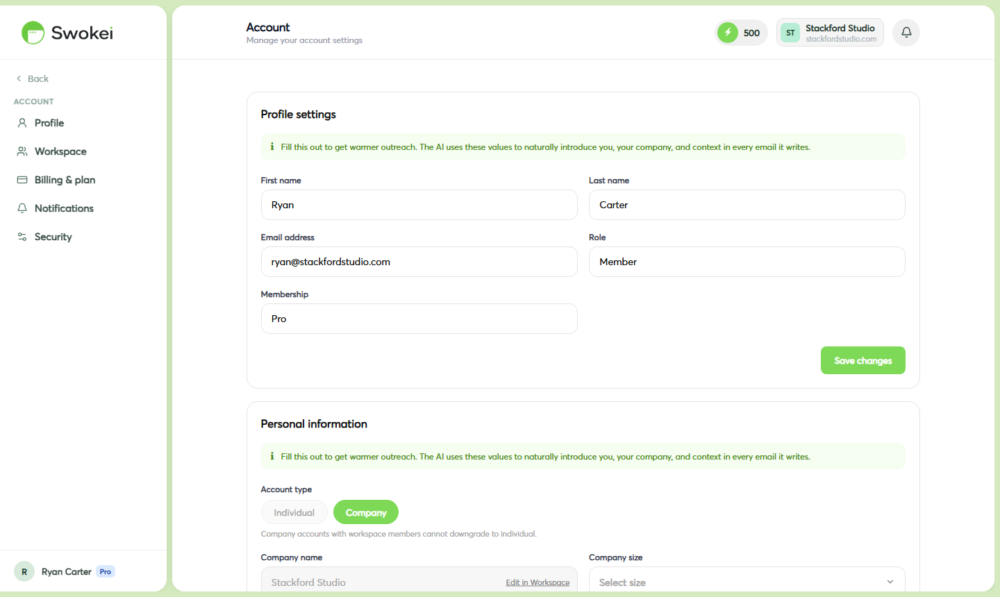

# Account Settings: Profile, Password & Email

Manage your personal information, security, notifications, and language preferences from your Account settings. You can update your name, email, password, and view active sessions — all in one place.

## Accessing your account settings

Click "Account" in the left sidebar to open your account management page. You'll see several tabs across the top: Profile, Workspace, Membership, Billing, Payments, Security, and Notifications. The Profile tab opens by default and is where you'll manage your personal details and password.

## Updating your profile information

On the Profile tab, you can edit your full name at any time. Click into the "Full name" field, update it to your preferred name, and click "Save". A green confirmation notification appears at the bottom of the screen once the change is saved.

## Changing your email address

Your email is your account login identifier, so changing it requires verification. Here's how it works:

- On the Profile tab, find the "Email address" field.
- Click into the field and type your new email address.
- Click "Save".
- Swokei sends a verification email to your new address. You must click the link in that email to confirm the change.
- Until you verify, your old email remains active for login. Once verified, your login email switches to the new one.
Each email address can only be associated with one Swokei account. If you need to manage multiple clients or brands, use a single account with the Workspace feature to collaborate with team members, or create separate accounts with different email addresses.

## Setting and resetting your password

You can change your password at any time from the Profile tab. Scroll down to the "Change password" section and fill in the fields:

- Enter your "Current password".
- Type your "New password" (minimum 8 characters).
- Confirm it in the "Confirm new password" field.
- Click "Update password". Your password changes immediately — you don't need to log out.
If you forget your password and can't log in: Go to the login page at app.swokei.com and click "Forgot password?" below the login form. Enter your account email and click "Send reset link". Check your inbox for an email titled "Reset your Swokei password" and click the "Reset password" button inside. You'll be taken to a page where you can set your new password. The reset link expires after 1 hour — request a new one if it times out. Once you set a new password, you're automatically logged in.

## Language preferences

Swokei supports English and Norwegian for both the app interface and campaign email generation. Your language preference in Account → Profile → Language controls the interface language and the language of notification emails Swokei sends to you. The language used in your campaign emails is set separately during campaign setup, so you can send outreach in different languages than your app interface.

## Managing notification preferences

You control which events trigger notifications on the "Notifications" tab. You'll see a list of notification types (like New interested reply, Campaign completed, or Mailbox error) each with a toggle switch. Click any switch to enable or disable that notification type — changes save automatically, so there's no separate save button.

## Viewing and managing active sessions

The "Security" tab shows all active login sessions on your account. Each session displays the device type and approximate location. If you spot a session you don't recognize or want to end a login on a device you no longer use, click "End session" next to it. To log out of all other devices at once, click "End all other sessions" — this is useful if you suspect unauthorized access or want to ensure you're only logged in on your current device.

## Deleting your account

If you decide to stop using Swokei, you can permanently delete your account. Scroll to the bottom of the Profile tab and click the red "Delete account" button. A confirmation dialog will appear explaining that this action is irreversible and will delete all your campaigns, leads, replies, credits, and mailbox connections. You'll need to type your account email address in the confirmation field to verify you understand the consequences before your account is deleted.

ON THIS PAGE

