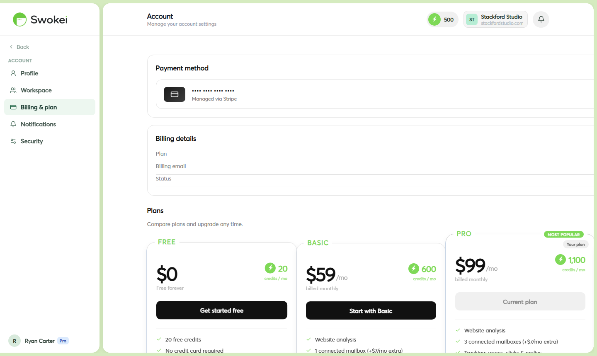

# Plans & Pricing

Swokei has four plans — Free, Basic, Pro, and Agency. All plans include every feature: website analysis, AI email generation, follow-ups, reply tracking, and CRM. The difference is how many credits you get each month and how many mailboxes are included.

## Plan comparison

## Understanding credits and rollover

Credits are used only for Smart Outreach — analyzing a prospect's website and generating a personalized email costs 1 credit. Sending emails, follow-ups, and tracking replies are all free. Credits renew each month and roll over to the next period if you don't use them all — but they're capped at 1× your monthly allocation. So if the Pro plan gives you 1,100 credits/month and you use only 500 one month, you'll have 1,600 credits in month two (500 unused + 1,100 new), but the maximum you can carry over is 1,100, so your balance caps at 1,100 + 1,100 = 2,200. Once you hit that cap, excess credits are forfeited.

## Billing intervals and discounts

Paid plans are available on monthly or annual billing. Annual billing is discounted — roughly 20% cheaper than paying month-to-month. You can select your billing preference at signup or switch between monthly and annual anytime from Account → Billing. If you switch mid-cycle, any unused portion of your current period is credited toward your new billing interval.

## Adding mailboxes

Each plan includes a set number of mailbox slots (Free: 0, Basic: 1, Pro: 2). Each additional mailbox costs extra and is billed monthly per slot. You can add mailboxes from Account → Billing → Add mailbox. Multiple mailboxes let you spread sending volume across different email addresses, which improves deliverability and lets you run higher-volume campaigns safely without triggering spam filters.

## Upgrading your plan

- Click "Account" in the sidebar.
- Click the "Billing" tab.
- Find the plan you want and click the "Upgrade" button.
- Confirm your payment details and click "Confirm upgrade".
- Your new plan is active immediately. Your credit balance updates right away — you keep existing credits and your new monthly allocation is added on top.
## Downgrading your plan

- Click "Account" in the sidebar.
- Click the "Billing" tab.
- Click "Change plan" or select a lower tier.
- Confirm the downgrade. The new terms take effect at the end of your current billing period.
- Until then, you keep all current features and credits.
When you downgrade, your credit balance is adjusted to fit the new plan's rollover cap. If you have more rolled-over credits than the new plan allows, the excess is forfeited at the end of your billing period. For example, if you downgrade from Pro (cap: 2,200 credits) to Basic (cap: 1,200 credits) and you have 1,800 credits, you'll keep 1,200 and lose 600. Any campaigns currently running aren't affected — they'll continue using whatever credits remain.

## Canceling your plan

- Click "Account" in the sidebar.
- Click the "Billing" tab.
- Scroll down and click "Cancel plan".
- Optionally provide a cancellation reason and confirm.
- Your paid plan stays active through the end of the billing period you've already paid for. After that, your account moves to the free plan (20 credits/month).
Your campaigns, leads, inbox messages, and all data are preserved when you cancel — nothing is deleted. You simply lose sending access until you're on a paid plan again. Reconnecting your mailbox is instant if you re-subscribe. Credits in your account don't disappear immediately either; they stay accessible during your remaining paid period. Once your account moves to free, your balance is adjusted to match the free plan's 20 credit monthly allocation.

## Pausing your subscription

Swokei doesn't offer a formal pause option, but you can achieve the same result by downgrading to the free plan. Your account and data remain intact, you stop being charged, and you can upgrade again whenever you're ready to run campaigns.

## Custom and Agency plans

For teams with high sending volume or custom needs, the Agency plan offers custom credit allocations, mailbox limits, and pricing. Contact the Swokei team through the support chat to discuss your specific requirements.

ON THIS PAGE

