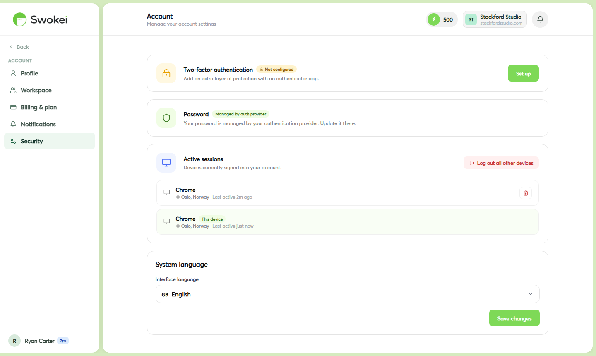

# Two-Factor Authentication

Two-factor authentication adds a second verification step to your Swokei login. Even if someone gets your password, they can't access your account without a code from your phone. We strongly recommend enabling it — your Swokei account has access to your sending mailboxes and lead data.

## How two-factor authentication works

Swokei uses TOTP (Time-based One-Time Password) — the same standard used by Google, GitHub, and most major services. You install an authenticator app on your phone, link it to your Swokei account by scanning a QR code, and from then on every login requires a fresh 6-digit code from the app. The code changes every 30 seconds, so even if someone intercepts one it's useless moments later. This method doesn't require SMS (which can be compromised) — everything happens on your phone within the app.

## Choosing an authenticator app

Any TOTP-compatible app works. Here are the most popular options:

- Authy (iOS/Android/desktop) — best option if you want backup and multi-device sync. Your 2FA secrets are encrypted and stored in the cloud, so if you get a new phone, your codes follow you.
- Google Authenticator (iOS/Android) — simple and widely used. No cloud backup by default, so save your recovery codes.
- 1Password or Bitwarden — if you already use a password manager, these support TOTP built-in. Your 2FA codes stay alongside your passwords.
- Microsoft Authenticator (iOS/Android) — works fine for TOTP even if you don't use Microsoft services.
## Enabling 2FA on your account

- Go to Account → Security.
- Click "Enable two-factor authentication".
- A QR code appears on screen. Open your authenticator app and scan it (usually a camera or + button in the app).
- Your app adds a Swokei entry and starts showing 6-digit codes that refresh every 30 seconds.
- Enter the current code from the app into the confirmation field on screen.
- Click "Confirm" — 2FA is now active on your account.
## Logging in with 2FA enabled

- Enter your email and password as normal.
- On the next screen, you're asked for your 6-digit verification code.
- Open your authenticator app, find the Swokei entry, and enter the current code.
- The code changes every 30 seconds — if you're close to a refresh and the code doesn't work, wait a few seconds for the next one and try again.
## Migrating to a new phone

If you're switching to a new phone and still have access to your old device, the safest approach is to disable 2FA on the old phone, then re-enable it on the new one:

- On your old device, go to Account → Security.
- Click "Disable two-factor authentication" and enter your password to confirm.
- On your new device, install your authenticator app and restore your codes if it has cloud backup, or follow the setup steps above to re-enable 2FA.
If you've already lost access to your old device before disabling 2FA, you'll need to use the recovery process described below.

## Disabling 2FA

- Go to Account → Security.
- Click "Disable two-factor authentication".
- Enter your account password to confirm the change.
- 2FA is removed immediately — your next login only requires email + password.
## Recovering access if you've lost your phone

If you lose your phone, replace it without disabling 2FA first, or accidentally delete your authenticator app without a backup, you'll be locked out at login.

To recover access:

- On the login screen, click "Can't access your authenticator?" (or contact support directly).
- Swokei will verify your identity through your registered email address and may ask additional verification questions.
- Once verified, we'll disable 2FA on your account so you can log in and re-enable it with a new device.
## Hardware security keys

Swokei currently supports TOTP apps only. Hardware keys (YubiKey, Google Titan, etc.) are not supported at this time. We use the standard TOTP protocol which works with phone-based authenticators.

## 2FA and team members

2FA settings are per-account, not per-workspace. Each team member on your workspace controls their own 2FA from their own Account → Security tab. You cannot require team members to enable 2FA from workspace settings (though this is on our roadmap for Agency plan users). If you're concerned about your team's security, encourage them to enable it individually.

ON THIS PAGE

