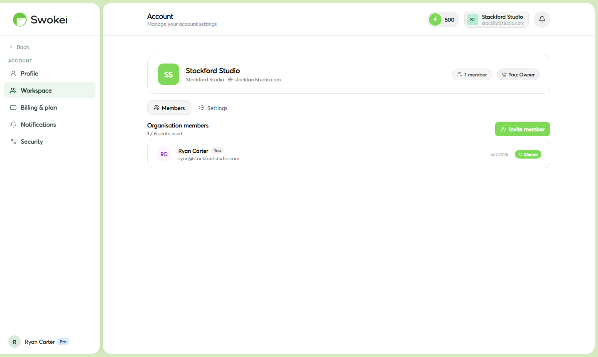
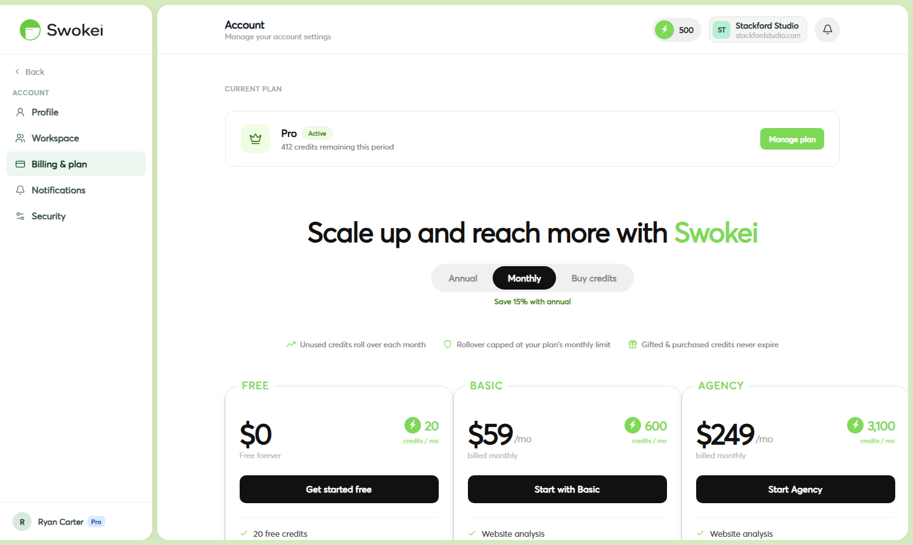

# Workspace & Team Members

Workspaces let multiple people collaborate under a shared company identity. Invite team members to access campaigns, replies, and lead data together.

## What is a workspace?

When you create a Swokei account, you own a workspace. A workspace represents your company or agency — it has a name, company details, and a list of members. Everyone in the workspace shares access to:

- All campaigns created by any member
- The shared reply inbox
- Lead and prospect data
- The CRM pipeline
Credits, billing, and mailboxes are tied to the workspace owner's account.

## Setting up your workspace

Go to Account → Workspace and fill in:

- Workspace name — typically your agency or company name
- Company name — used in email signatures and sender defaults
- Company size — helps configure appropriate defaults
- Location — country and city of your business
- Website — your agency's website
## Inviting team members

To invite someone to your workspace:

- Go to Account → Workspace → Members
- Click Invite member
- Enter their email address and choose a role
- Click Send invite
The invited person receives an email with a link to join. They'll need to create a Swokei account if they don't have one. The invite link expires after 7 days — you can resend it from the Members tab.

## Member roles

### Owner

Full access to everything including billing, plan management, and workspace settings. There is one owner per workspace — ownership can be transferred by contacting support.

### Member

Can create and manage campaigns, view and reply to leads, and use all outreach features. Cannot access billing settings or remove other members.

## Removing a member

Go to Account → Workspace → Members, find the member, and click Remove. Their account remains active (they can still log in) but they lose access to your workspace. Any campaigns they created remain in the workspace.

## Leaving a workspace

If you were invited as a member (not the owner), you can leave a workspace from Account → Workspace → Leave workspace. This doesn't delete your Swokei account.

## What can members see and do?

Members have access to all the core product features — they can create and manage campaigns, view all replies in the shared inbox, manage leads, use the CRM, and connect their own mailboxes. The key things they cannot do:

- Access billing or change the plan
- Purchase extra credits or mailbox slots
- Remove other members from the workspace
- Delete the workspace
- Change workspace ownership
Members can see all campaigns, all replies, and all CRM data — including campaigns and replies created by other members. The inbox is shared; there's no private view per member.

## Do members use the owner's credits?

Yes. All campaigns run by any workspace member draw from the same credit balance that belongs to the workspace owner. If you invite someone who runs a 200-lead campaign, that uses 200 of your credits. Monitor usage in Account → Billing & plan → Credit history, which shows credits used per campaign so you can see who is using what.

## Can members connect their own mailboxes?

Yes. Each member can connect their own Gmail or Outlook account as a mailbox in the workspace. That mailbox is then available to any workspace member when creating or editing a campaign. This is how agencies run outreach from different team members' email addresses while managing everything centrally.

## What happens to campaigns if I remove a member?

Removing a member doesn't delete their campaigns, leads, or replies. Everything they created stays in the workspace and remains accessible to remaining members. The removed member immediately loses access — they can no longer log in and see the workspace.

## Can I have multiple workspaces?

Each Swokei account belongs to one workspace at a time. You can be the owner of one workspace and a member of another, but you can't own multiple workspaces under the same account. If you need separate workspaces for separate clients or brands, you'd need separate Swokei accounts.

## Workspace availability by plan

Workspace collaboration features (inviting members, shared inbox access) are available on Basic, Pro, and Agency plans. Free accounts can fill in workspace details but cannot invite members until they upgrade to a paid plan.

ON THIS PAGE

