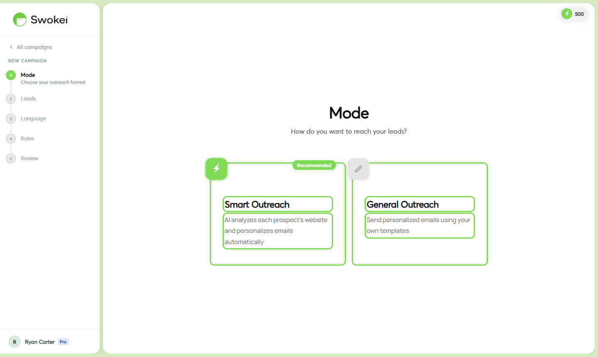

# Campaign Types: Smart Outreach vs General Outreach

Swokei has two campaign types. Choosing the right one determines whether Swokei writes your emails for you based on website analysis, or whether you bring your own message and just use Swokei to send and track replies.

## Smart Outreach

A Smart Outreach is Swokei's flagship feature. You provide a list of leads with websites and email addresses. For each lead, Swokei:

- Visits and analyzes the prospect's website
- Scores it across six dimensions (design, SEO, mobile, performance, trust, content quality)
- Identifies the 2–3 most impactful problems found on their site
- Generates a personalized cold email that references those specific issues
- Sends the email from your connected mailbox on the schedule you set
- Follows up automatically according to your sequence if they don't reply
Every email in a Smart Outreach is unique — written specifically for that lead's website. A prospect whose site is slow gets an email about page speed. One with a broken mobile layout gets an email about that. This is what separates Swokei from mail merge tools: the personalization is about something real and specific to them.

### Best for

- Web design and development agencies pitching redesign services
- SEO agencies offering audits, optimization, or ongoing retainers
- Performance optimization and Core Web Vitals consultants
- Digital marketing agencies whose pitch centers on improving a client's online presence
- Anyone cold-approaching businesses where "your website needs work" is the hook
### Credit cost

1 credit per lead successfully analyzed and emailed. If analysis fails (site is down, blocked, or URL is invalid), the lead is marked Skipped and no credit is charged. Sending, follow-ups, reply tracking, and CRM features are all free on top of that credit.

### What happens if a site can't be analyzed?

In the Rules step during campaign setup, you choose what to do with unreachable sites: skip them entirely, or email them anyway with a more generic message. The skip option is safer — no credit is charged, and the lead stays in the campaign for potential retry. The "email anyway" option uses a credit and sends a less personalized email.

## General Outreach

A General Outreach campaign is for when you already have the message and just want Swokei to handle sending, tracking, follow-ups, and reply management. You upload a lead list and write one email template (with optional merge fields like {{firstName}} and {{companyName}}). Swokei sends it on schedule.

No website analysis happens. No credits are used.

### Best for

- Campaigns where your pitch isn't website-specific (e.g. a fixed-price social media management package)
- Re-engagement campaigns to old leads who went quiet
- Follow-up campaigns to people who opened but never replied
- Testing subject lines or message angles at scale before investing in analysis
- Outreach in industries where website quality isn't the pain point (e.g. recruiting, event invitations, product announcements)
### Credit cost

None. General Outreach campaigns never consume credits regardless of list size.

### Writing the email in a General Outreach

In the campaign wizard, after the Leads step, you'll see a full email editor where you write your subject line and body. You can use merge fields (Swokei substitutes these from your lead list columns):

- {{firstName}} — lead's first name
- {{lastName}} — lead's last name
- {{fullName}} — full name
- {{companyName}} — company name from your CSV
- {{website}} — their website URL
If a field is blank for a lead, Swokei leaves it empty rather than inserting a placeholder. Make sure your list is clean before using merge fields.

## Side-by-side comparison

## Can I switch types after creating a campaign?

No — the campaign type is set at creation and can't be changed. If you want to switch from Smart to General Outreach (or vice versa), create a new campaign with the same lead list.

## Can I run both types at the same time?

Yes, completely independently. A common pattern: run a Smart Outreach to cold leads with personalized analysis-based emails, and run a simultaneous General Outreach to warm leads who previously showed interest but went quiet. Both campaigns send from the same mailbox (or different ones if you prefer to keep them separated) and all replies land in the same unified Inbox.

## Which type should I start with?

If you're testing Swokei for the first time, start with a Smart Outreach on a small list of 20–50 leads. Use the generated emails to calibrate your expectations — read through a sample before they send to check the quality and tone. Once you've seen how the AI writes, you'll have a much better sense of what a full campaign will look like before you invest more credits.

ON THIS PAGE

