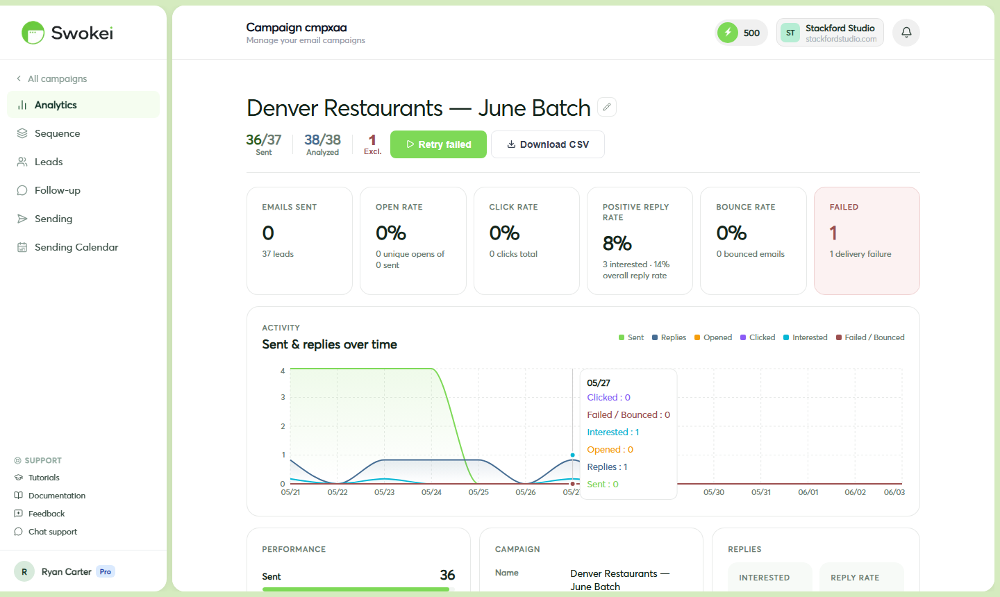

# Email Open & Click Tracking

Swokei tracks when cold emails are opened and when links inside them are clicked. This gives you engagement signals even before a prospect replies, helping you understand which campaigns resonate and which leads are actively interested.

## What Swokei tracks

- Opens — when a recipient opens your email, tracked via a small invisible pixel in the email body
- Clicks — when a recipient clicks a link in your email. All links are automatically wrapped with tracking to detect clicks.
- Multiple engagements — Swokei counts how many times the same email was opened or the same link was clicked, useful for spotting leads who keep coming back
- Timing — the exact timestamp of the first open and first click for each lead
## Where to find tracking data

### For a single lead

Open a campaign and click on any lead in the lead table. The lead detail panel shows badges for Opened and Clicked if the lead has engaged, along with the date of first engagement. Scroll down to see the email record and engagement details.

### For your entire campaign

Look at the stats bar at the top of the campaign detail page. It shows counts of Sent, Opened, Clicked, and Replies. The activity chart below plots engagement over time — you can see when emails went out and when recipients opened them.

## Using open and click data to prioritize follow-up

Opens and clicks are signals of interest even before a reply arrives. A lead who has opened your email three times is clearly paying attention. Use this to your advantage:

- On the campaign detail page, sort the lead table by Opens (highest first) to see your most-engaged prospects.
- For leads with multiple opens but no reply yet, check when they're scheduled to receive their next follow-up. If they're already getting one, that's good — if not, consider reaching out manually. These are warm leads.
- A lead who clicked a link is showing even stronger intent. Treat them with the same priority as leads classified as Interested in your Inbox.
## Important limits of open tracking

Open tracking is useful but not perfect. Here are the main factors affecting accuracy:

### Apple Mail Privacy Protection

Since iOS 15 (2021), Apple Mail automatically pre-fetches images and tracking pixels in the background, regardless of whether the user actually opened the email. This can massively inflate open rates if your audience uses Apple Mail on iPhone, iPad, or Mac. If you see an 80%+ open rate with few replies, Apple Mail pre-loading is likely the cause.

### Email clients that block images

Some email clients block images by default, which also blocks the tracking pixel. These opens won't be recorded. This means your actual open rate is probably higher than what Swokei reports.

### Corporate security scanners

Some organizations automatically scan links in incoming emails for security threats. This can trigger a "click" event even if the human recipient never actually clicked the link.

## Open rates that seem too high

If your open rate is 80% or higher, Apple Mail Privacy Protection is almost certainly the cause. This is especially true if you're reaching out to people in companies with high rates of Apple device use. In this case, rely on reply rate, not open rate, as your primary performance metric.

## Zero click rate — is that normal?

Yes. Cold emails typically don't contain links — adding links actually increases spam filter risk and signals "marketing" to the recipient. If your emails have no links, a 0% click rate is correct and expected. Click tracking is more relevant for follow-up sequences where you've intentionally included a link (like a Calendly booking URL) or for General Outreach campaigns where you control the email content.

## How long is tracking data kept?

Open and click data is stored for the lifetime of your account. You can look back at engagement from any past campaign at any time. Historical data is never deleted when a campaign completes or is archived.

## Can Swokei detect which device or email client opened the email?

No — Swokei records that an open occurred and the timestamp of the first open, but doesn't identify the device type, email client, or location of the opener. Open count and timing are visible, but deeper device-level analytics are not available.

ON THIS PAGE

