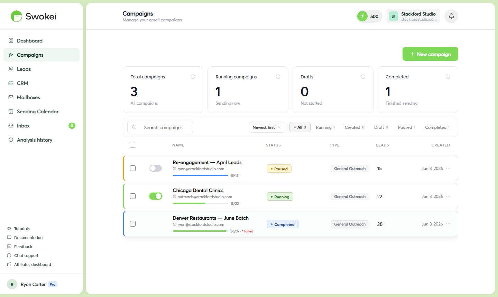
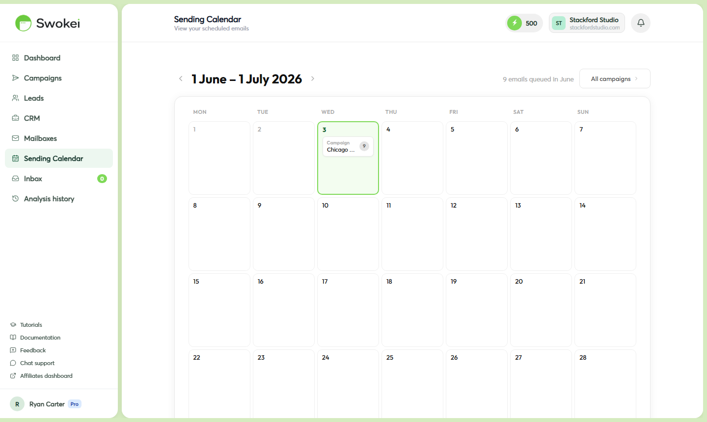

# Managing Campaigns: Pause, Resume & Monitor

Learn how to monitor a running campaign, interpret lead statuses, pause and resume sending, edit emails before they go out, add more leads mid-campaign, and delete campaigns when you no longer need them.

## Opening a campaign

In the sidebar, click "Campaigns". You'll see your campaign list with status badges on each (Draft, Running, Paused, Completed). Click any campaign name to open its detail page.

## Understanding the campaign detail page

The campaign detail page has several sections:

- Stats bar — top of page shows totals: Sent, Replied, Failed, Pending at a glance
- Activity chart — line graph showing daily sends and replies over the campaign lifetime
- Lead table — full list of every lead with sortable columns (status, email, website, sent date, website score)
- Sequence editor — your follow-up steps, accessible via a Sequence tab
- Settings — sending mailbox, language, tone, etc., accessible via a Settings tab or gear icon

## What each lead status means

## Pausing a campaign

On the campaign detail page, find the "Pause Campaign" button in the top-right area (visible when the campaign is Running). Click it. The status changes to Paused and all sending stops immediately.

Common reasons to pause:

- Your sending mailbox needs to be reconnected or updated
- You want to review and edit generated emails before more go out
- You're away and want to stop sending while unavailable to reply
- You spotted an issue in the lead list that needs fixing
## Resuming a campaign

On a paused campaign, the button becomes a green "Resume Campaign" button. Click it. The status changes back to Running and sending continues from where it paused. Queued emails send, and follow-up timers continue from the pause point.

## Editing an email before it sends

For any lead still in Ready status (email generated but not sent), you can edit the subject line or email body before it goes out. Find the lead in the lead table, click on its row to expand it, then click the edit icon next to the email. Make your changes and click Save. The updated version is what will be sent.

You cannot edit emails that have already been sent (Sent, Replied, Follow-up statuses).

## Adding more leads to a running campaign

You can add leads to a campaign that's already running. On the campaign detail page, look for an "Add leads" button. A modal opens with the same options as the initial upload — CSV, Google Sheets, or Lead Library. Map columns, confirm, and the new leads are added immediately. They enter the analysis and generation queue just like the original batch and inherit the campaign's follow-up sequence.

## Using the Sending Calendar

For a timeline view of all scheduled email sends across all campaigns, click "Sending Calendar" in the sidebar. Each day shows how many emails are queued. Click on a day to see which emails are scheduled, which campaign they belong to, and which mailbox is sending them.

Use this to verify emails scheduled after launch, and to check if any day is overloaded for a particular mailbox.

## Deleting a campaign

Open the campaign and go to the Settings tab. Scroll to the bottom and click the red "Delete campaign" button. A confirmation dialog appears — click Delete again to confirm. The campaign and all its data are permanently removed.

## What happens to Skipped leads?

Skipped means Swokei tried to analyze the lead's website but couldn't access it — site was offline, blocked automated access, or the URL was invalid. No credit was charged. To retry, click the lead in the table and look for a Retry option. If the site is genuinely inaccessible, you can't send a Smart Outreach. Consider adding them to a General Outreach campaign where you write the email yourself.

## Can I change the sending mailbox on a live campaign?

No — the mailbox is fixed at launch. To switch mailboxes, you'd need to pause the campaign, identify leads that haven't been sent yet, and create a new campaign for them with the different mailbox. Plan mailbox assignment before launching to avoid this.

## Can I duplicate a campaign?

There's no one-click duplicate, but recreating one is fast. Open the completed campaign, note the subject line, follow-up sequence, and rules settings, then create a new campaign and apply the same configuration to a new lead list.

ON THIS PAGE

