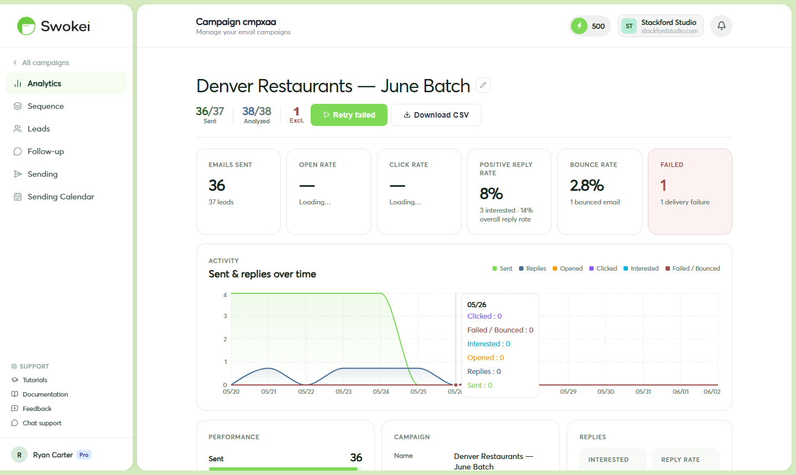

# Reading Your Campaign Analytics

Every campaign includes a built-in analytics section showing how your outreach is performing. Learn what the numbers mean, how to interpret them, and what to do when results aren't meeting your goals.

## Finding your analytics

Go to the Campaigns page, click on the campaign you want to review. At the top of the campaign detail page, you'll see a stats bar with summary numbers. Below that is an activity chart that plots performance over time.

## Understanding the stats bar

## What the activity chart shows

The chart below the stats plots sent, opened, clicked, and interested reply counts on a daily timeline. Interpreting it:

- Spikes in sent — batch send moments, usually when a campaign launches or resumes
- Opens lagging 1–3 days behind sends — normal. People open emails when they have time, not immediately.
- Replies across days — replies can arrive throughout the campaign as follow-ups trigger and people respond
- Flat sections — indicate periods when the campaign was paused or no new activity occurred
## Benchmarking your open rate

Cold email open rates vary by industry and approach. Use these as rough guidance:

- Under 30% — below average. Subject line may need work, or deliverability issues may be sending emails to spam.
- 30–50% — healthy. Emails are reaching the inbox and your subject line is working.
- Over 50% — strong. Note that Apple Mail Privacy Protection can inflate this number artificially.
## Benchmarking your reply rate

For personalized cold outreach with website analysis (Smart Outreach):

- Under 1% — something needs attention. Check deliverability, list quality, or email messaging.
- 1–3% — average for cold outreach
- 3–6% — good. Your targeting and message match well.
- Over 6% — excellent. Scale this approach further.
## Diagnosing low open rates

If your open rate is under 20%, check these in order:

- Deliverability. Test your mailbox at mail-tester.com. A poor deliverability score means emails are landing in spam filters before recipients can open them. This is often the culprit.
- Subject line specificity. Is your subject line specific to each lead's business, or generic? Specific, personalized subjects always outperform generic ones.
- Warmup status. Check your email warmup — an under-warmed mailbox will have poor inbox placement. Allow a few weeks of warmup before expecting strong open rates.
## High open rate, zero replies — what went wrong?

This is the most common issue people debug. Your subject line and email are getting noticed, but the content isn't convincing. Common causes:

- Email is too long or too salesy. Read 10–15 generated emails from the campaign. If they read like a brochure or pitch deck, that's the problem. Cold emails need to be conversational and brief.
- Call to action is too high-commitment. "Book a call" as a first ask is hard to convert. Try "Would this be worth a quick look?" or "Curious if this resonates?" — much lower friction.
- Lead quality is too high. Businesses with strong, well-maintained websites (score 8–10) don't need your services. Filter for lower-scoring sites (5–7) to target businesses that actually need help.
- Apple Mail inflation. If your audience is Apple-heavy, Apple Mail Privacy Protection may be inflating your open rate. Your actual performance might be fine.
## High bounce or failure rate

If more than 5% of emails bounce or fail:

- Check the lead list for bad email addresses — invalid domains, obvious fakes, or formatting errors.
- For SMTP mailboxes, verify the mailbox is still authenticated. Sending failures (different from bounces) mean the mailbox couldn't send at all.
- Consider running your lead list through an email verification service before your next campaign.
## Realistic timeline for campaign results

Here's what to expect with a typical 50-lead campaign:

- Day 1: First emails start going out
- Days 1–3: Most opens happen within 48 hours of delivery
- Days 1–5: First replies usually arrive in the first few days
- Days 7–14: First follow-ups trigger, bringing a second wave of replies
- Days 14–21: Second follow-up if configured
## Exporting campaign data

On the campaign detail page, look for an "Export" or "Download CSV" button. Click it to download a spreadsheet with all leads, their send status, open status, click status, and reply classification. Use this for deeper analysis or reporting.

ON THIS PAGE

