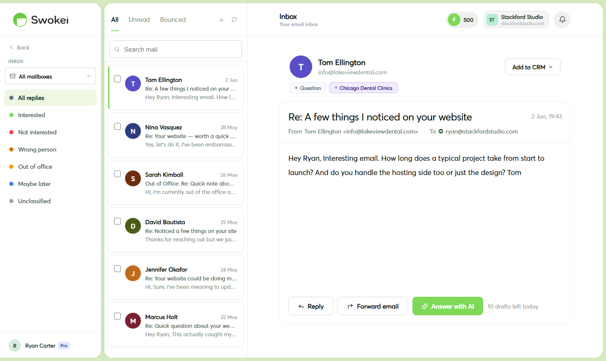
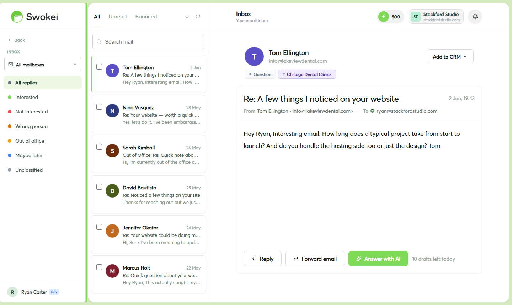
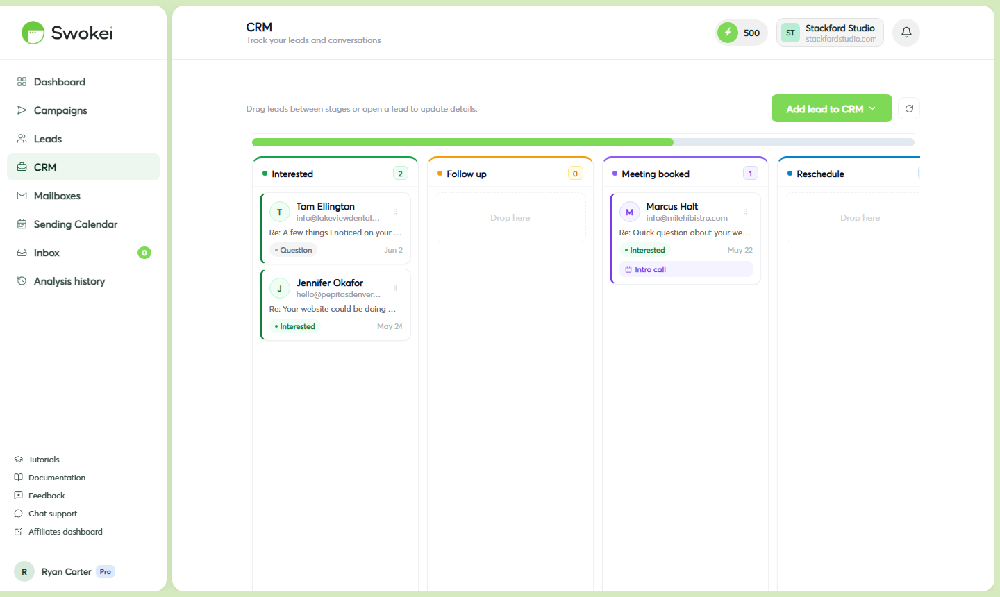
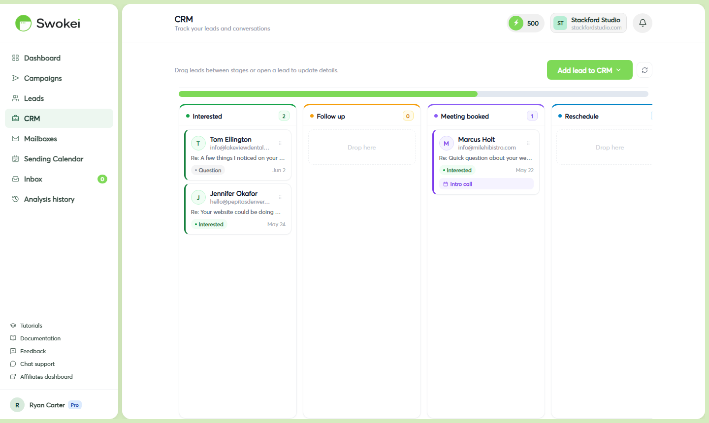

# Reply Classification & CRM

When leads reply to your campaigns, Swokei reads and automatically classifies each message so you know which ones need immediate attention. The built-in CRM lets you track deal stages, add notes, record meetings, and manage your entire pipeline without leaving Swokei.

## Inbox: where all replies land

Click "Inbox" in the sidebar. This unified feed shows every reply from every campaign, sorted by most recent first. Each reply card displays the sender, campaign origin, classification badge, reply snippet, time received, and read status. Click any reply to open the full thread and CRM panel.

## What the classifications mean

## Filtering your Inbox

At the top of the Inbox page are filter options. Click any classification badge (e.g. "Interested") to show only that type. Use the "All campaigns" dropdown to filter by a specific campaign. Toggle "Unread" to see only messages you haven't read yet. Filters combine — for example, "Interested + Unread from Campaign A."

## The CRM panel — tracking deals

When you open a reply, the right side shows the CRM panel for that lead. This is where you manage deal progression.

### Setting a deal stage

Click the "Deal stage" dropdown and select one of these:

- Contacted — initial outreach sent
- Call booked — meeting scheduled
- Proposal sent — quote or proposal delivered
- Won — deal closed
- Lost — deal fell through
The stage saves instantly.

### Adding notes

Click in the "Notes" field and type your observations from the conversation — what they said, their budget, timeline, concerns. Notes save automatically when you click away.

### Logging a deal value

Enter the estimated or agreed contract value in the "Deal value" field (e.g. 2500). This feeds into the CRM pipeline view so you can see total pipeline value at a glance.

### Recording a meeting

In the CRM panel, look for the "Meeting" section. Click "Add meeting" and fill in:

- Meeting title — e.g. "Discovery call"
- Date and time — click to open date picker, set the time
- Join link — paste a Zoom, Google Meet, or Calendly URL
Click "Save meeting". The meeting also appears on the Sending Calendar page alongside email scheduling.

### Correcting a classification

If the AI got it wrong, click the "Classification" dropdown in the CRM panel, select the correct one, and it saves immediately. For ambiguous replies, always check — takes two seconds and keeps your pipeline accurate.

## Marking replies as answered

Once you've responded personally and the reply needs no more attention, click "Mark as answered" in the reply view (top of CRM panel or near reply actions). This removes it from your active view so it doesn't clutter the Inbox.

## The full CRM pipeline view

For a comprehensive view of all deals, click "CRM" in the sidebar. This shows a table of every lead with a deal stage set, sortable by stage, campaign, deal value, and last activity. Use the "Stage" filter at the top to narrow to specific stages — for example, click "Call booked" to see everyone you have a meeting with, or "Proposal sent" to see who's awaiting a decision.

Click any row to open that lead's detail with full reply history and all CRM data.

## How accurate is AI classification?

For clear-cut replies (enthusiastic interest, firm rejection, obvious out-of-office), accuracy is very high — typically 95%+. Ambiguous replies that could go either way ("We're not looking to change anything right now but it's interesting") are where it struggles. When in doubt, override manually — it's instant and keeps your pipeline data clean.

## Exporting CRM data

Swokei's CRM doesn't currently have native integrations with Salesforce, HubSpot, or Pipedrive. To export your pipeline, go to a campaign detail page and look for the "Export" option. Download the CSV, which includes deal stage, notes, deal value, and classification for all leads. You can import this manually into most CRM tools.

ON THIS PAGE

