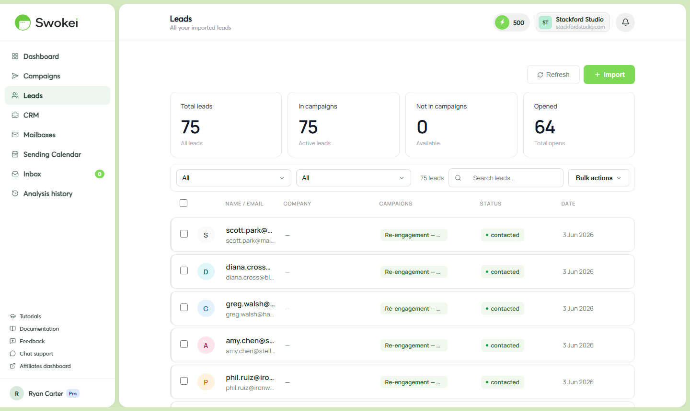

# Using the Lead Finder

The Lead Finder helps you discover local businesses in any city and industry without needing an external lead list. Search by city and industry, browse results, select the ones you want, and add them directly to a campaign.

## Finding the Lead Finder

Click "Leads" in the left sidebar. The Leads page opens with a search form at the top containing two fields and a button:

- City — the location (Oslo, Bergen, Manchester, London, etc.)
- Industry — the business type (restaurants, dental clinics, accountants, plumbers, web agencies, etc.)
- "Find leads" button — starts the search

## Running a search

- Type the city name in the City field.
- Type the industry or business type in the Industry field. Be as specific or as broad as you want — "restaurants" gets more results than "Japanese restaurants", but more specific searches often yield better-targeted leads.
- Click "Find leads". Results appear in 5–10 seconds.
Each result shows the business name, website URL, email address (where publicly available), and sometimes phone number and address.

## Selecting and filtering results

Each result has a checkbox. You can click individual checkboxes to select specific leads, or click "Select all" at the top to select every result in the search. If a filter option appears (like "Has email"), use it to show only results with email addresses — leads without emails can't receive campaigns.

Before selecting all, scroll through and uncheck any obvious misfits — very large enterprises that aren't your target, businesses without websites, or duplicates you've already contacted.

## Adding to a campaign

After selecting leads (you'll see a count like "14 selected" at the top), click the "Add to campaign" button. A modal opens with two options:

- "Add to existing campaign" — select from your current campaigns. The leads are added immediately.
- "Create new campaign" — takes you to campaign creation with these leads already loaded. Configure campaign name, mailbox, language, follow-ups as normal.
A confirmation message shows how many leads were added.

## Getting the most from the Lead Finder

### Be specific with industry terms

"Businesses in Oslo" returns a useless mix. "Dental clinics in Oslo" or "web design agencies in Oslo" returns a targeted list. Specific industry terms produce better-quality leads that match your pitch better.

### Search the same niche across multiple cities

If you serve a specific vertical (e.g. accountants), run the same search across several cities to build a large list quickly. "Accountants in Bergen", "Accountants in Stavanger", "Accountants in Trondheim" builds a regional list in minutes.

### Look for obvious improvement opportunities

The Lead Finder shows website URLs you can preview. Before launching a campaign, spot-check a few sites. Businesses with outdated, slow, or clearly mobile-unfriendly websites are your best targets — they have obvious problems to reference and are more likely to convert.

### Combine with other lead sources

The Lead Finder is great for initial discovery. Supplement it with leads from LinkedIn, industry directories, or referral lists by uploading a CSV. Both sources add to the same campaign and work identically inside Swokei.

## Your Leads database

Every lead you've ever added to Swokei — from the Lead Finder or CSV upload — is stored in your Leads database. Scroll down past the search form on the Leads page to see them all. The table shows each contact's name, email, website, which campaign they were part of, and their reply status. Use this to check if you've already contacted someone before adding them to a new campaign, and to see their full history.

## Data accuracy and freshness

Lead Finder data comes from business directories and web indexes that are regularly refreshed, but not real-time. Contact information for newly opened or closed businesses may be out of date. Email addresses are verified at search time where possible, but some bounces are normal — expect a small percentage of undeliverable addresses. This is typical for any lead source.

## Geographic coverage

The Lead Finder works best in US, UK, Canadian, and Australian markets where directory coverage is strongest. European and international markets vary — some cities and industries are well-covered, others less so. Run a test search for your target location to see coverage before committing a large campaign.

## Exporting Lead Finder results

Lead Finder results can be added to a campaign or saved to your Leads database. From the Leads database, export your contact list to CSV using the export option at the top of the table. There's no direct "export raw search results" option — add them to a campaign or database first, then export.

ON THIS PAGE

