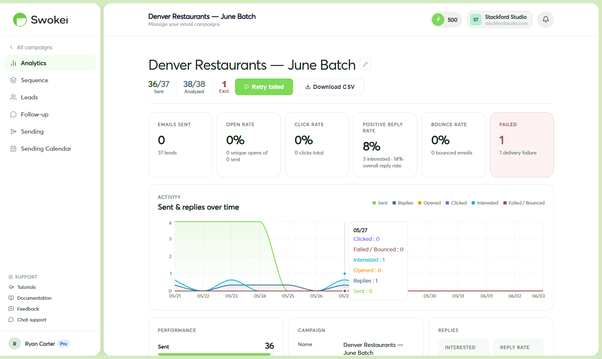

# Writing Better Cold Emails

Swokei writes your cold emails automatically based on website analysis. Understanding what makes a cold email effective — and how to edit the AI's output — helps you get better reply rates. This guide covers the fundamentals, what to fix in generated emails, and what to avoid entirely.

## The core principle

A cold email is not a sales pitch. It's a conversation starter. Your goal is not to close a deal in the first message — it's just to get a reply. Keep this in mind whenever you're tempted to add more information or explain more benefits. Less is almost always more in cold email.

## Editing emails before they send

After launching a Smart Outreach campaign, any lead with a Ready status (email generated but not sent) can be edited. Find the lead in the campaign lead table, click on its row to open the detail panel, then click the edit icon next to the email subject or body. Make your changes and click Save. Only Ready emails are editable — once sent, emails can't be changed.

## What makes subject lines get opened

The subject line is your first and only impression. The best ones share these traits:

- Short — under 6 words. Longer subjects get cut off on mobile and look like newsletters.
- Specific — reference something real about their business, not generic praise. "noticed something on your site" beats "we can help your business."
- Conversational — written like a real person typed it, not a marketing team. Lowercase usually works better than title case.
- Honest — never fake a prior conversation with "Re:" or "Following up." One opening breaks trust completely.
### Subject lines that work

### Subject lines that don't work

## The structure that converts

The most effective cold emails follow a simple 4-part pattern — keep it to 3–5 sentences total, 100–150 words maximum:

### Part 1 — Specific observation (1–2 sentences)

Open with something real you noticed about their site. Not "I love what you're doing!" — that reads as copy-paste. Instead: "I came across Bloom Dental's website and noticed it doesn't load well on mobile — the navigation overlaps the booking button on smaller screens."

### Part 2 — One-sentence consequence

Connect the observation to something they care about: "Since most patients search for dentists on their phones, this is probably affecting your booking completions."

### Part 3 — The offer (1–2 sentences)

What you can do — brief, no pitch deck: "I work with local clinics to fix exactly this kind of issue — usually a small, focused project."

### Part 4 — One low-friction ask

One clear, easy ask that doesn't require a big commitment: "Would it be useful if I put together a few specific suggestions for your site?" works far better than "Book a 30-minute discovery call."

### Full example

## Five things that kill reply rates

### 1. Pitching too hard in the first email

Listing every service, adding pricing, including case studies, and asking for a call all in one message overwhelms and signals low confidence. People confident in their work let it speak for itself with minimal words.

### 2. Talking about yourself too much

Count "I/we/our" versus "you/your" in your email. It should be mostly about them — their site, their situation, their problem. If your first sentence is "I am Ahmed from [Company]…", rewrite it to start with something about them instead.

### 3. Dense paragraphs

Cold emails are read on phones between meetings, in seconds. Three short paragraphs with white space between them get read. One dense block gets deleted.

### 4. Generic compliments

"I love what you're doing at [Company]" without specifics reads as obvious mass-mail copy. Swokei avoids this because its emails are based on actual website analysis. When editing, don't add generic praise.

### 5. Spam trigger words

These reliably trip spam filters: "guaranteed", "no risk", "act now", "limited time", "click here", "100% free", "winner", "urgent". Avoid them entirely.

## Testing and improving

Cold email performance improves through testing:

- Run two campaigns against the same audience with different subject lines or different CTAs.
- After 2–3 weeks, compare reply rates in the campaign analytics.
- Use the better-performing version as your baseline for the next test.
- Repeat. Small, consistent improvements compound significantly over months.
## How long should your email be?

Short. 3–5 sentences is ideal. 100–150 words maximum. Anything longer signals you're selling hard, which triggers resistance. The goal of the first email is a reply — say enough to intrigue and leave the rest for the conversation.

ON THIS PAGE

