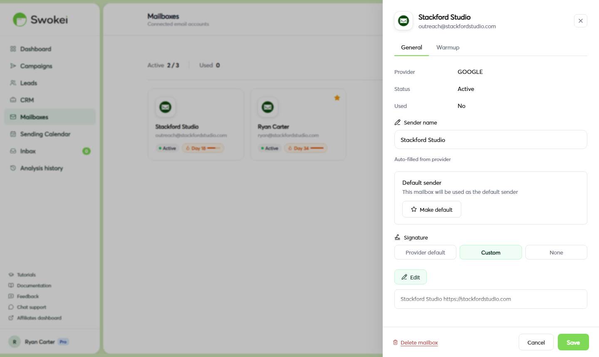

# Connecting a Gmail Account

Connecting Gmail via OAuth is the recommended method for Swokei. It's the most reliable way to send campaigns, automatically refreshes your access token, and your Gmail password is never stored in Swokei or shared with anyone else.

## Getting ready

Before you begin, make sure you're already signed into the Google account you want to connect in your browser. If you have multiple Google accounts, it's faster to be pre-logged-in to the correct one so you can select it immediately during the OAuth flow.

## Connecting your Gmail account

- In the Swokei sidebar, click "Mailboxes".
- Click the green "Add mailbox" button. A modal titled "Connect a mailbox" opens.
- Click "Connect Gmail". A Google OAuth pop-up window opens in your browser.
- If you're signed into multiple Google accounts, Google displays a list of them. Click the account you want to connect to Swokei.
- Google shows a permissions screen listing what Swokei needs access to—sending emails and reading replies. Click "Allow".
- The pop-up closes automatically and you're returned to Swokei. Within a few seconds, your mailbox appears in the Mailboxes list with a green "Connected" badge.

## Personalizing your mailbox display and signature

After connecting, click on your new mailbox in the Mailboxes list to open its settings drawer. In the "General" tab, you'll see your mailbox configuration options.

First, set how your name appears to recipients. The "Display name" field defaults to the name on your Google account, but you can change it to anything—"Ahmed," "Ahmed from Swokei," or a team name. Update the field and click "Save". A green notification confirms the change.

Scroll down in the drawer to the "Signature" section. You have three options:

- "Use provider signature" — automatically pulls your existing Gmail signature from your Gmail settings. Choose this if you already have a signature you like in Gmail.
- "Custom signature" — a text editor appears where you can write a signature directly in Swokei. This signature exists only for Swokei campaigns and doesn't change your Gmail settings.
- "No signature" — sends emails without any signature block.
Select your preference, write a custom signature if needed, and click "Save".

## Setting a default mailbox

If you have multiple mailboxes, you can mark one as the default so new campaigns automatically use it. In the mailbox settings drawer, toggle on "Set as default mailbox" and click "Save". You can still override the default when creating a specific campaign.

## Verifying your connection works

The easiest way to test your connection is to create a simple test campaign with one or two email addresses you own and send it. In the Mailboxes list, a green "Connected" badge means the mailbox is active and ready. A yellow or red badge indicates a problem—click on the mailbox to see the error details.

## Sending limits for Gmail

Google enforces daily sending limits based on your account type:

- Free Gmail (@gmail.com): approximately 500 recipients per day via API
- Google Workspace (paid): approximately 2,000 recipients per day
Swokei respects these limits automatically. If you hit your daily cap, sending pauses and resumes the next day from where it left off—no emails are lost. For sustained campaign volume beyond a few dozen daily emails, use a Google Workspace account.

## How many Gmail accounts can I connect?

Your plan determines how many mailbox slots you have. The Basic plan includes 1 mailbox, Pro includes 2. You can purchase additional mailbox slots as a monthly add-on from Account → Billing & plan. Agencies running large outreach operations often maintain 5–10 mailboxes to distribute sending volume and improve deliverability.

## Reconnecting when your token expires

Gmail OAuth tokens are long-lived but can expire if you change your Google password, revoke Swokei's access in your Google security settings, or have an extended period of inactivity in Swokei. When this happens, the mailbox shows a red warning badge in the Mailboxes list.

Click on the mailbox to open its settings drawer. You'll see an error message and a red "Re-authorize" button. Click it, complete the Google OAuth pop-up, and your connection is restored. Campaigns resume automatically.

## Protecting your inbox and reputation

## What permissions does Swokei need?

Swokei requests access to read and send emails in order to detect replies to your campaigns. It only monitors emails it sent—it doesn't read your full inbox, access unrelated conversations, or store email content beyond what's needed for AI reply classification. Your Gmail password is never stored, displayed, or shared.

## Troubleshooting connection problems

### "This app isn't verified" — Google warning screen

When authorizing Swokei to send emails, Google sometimes shows a warning page with a warning icon stating "Google hasn't verified this app." This is a standard warning for third-party email tools and doesn't indicate any security problem.

To proceed, click the small "Advanced" link at the bottom-left of the warning screen, then click "Go to Swokei (unsafe)". You'll be taken to the normal permissions screen where you can click Allow.

### The pop-up opened but closed immediately

Your browser is blocking pop-ups from app.swokei.com. Look for a pop-up blocked notification in your browser's address bar (usually a small icon on the right). Click it and select "Always allow pop-ups from app.swokei.com", then try adding the mailbox again.

### You connected the wrong Google account

Go to Mailboxes, click the incorrectly connected mailbox, and scroll to the bottom of the settings drawer. Click "Delete mailbox", confirm the deletion, then click "Add mailbox" again. This time, ensure the correct account is selected in the Google pop-up.

ON THIS PAGE

