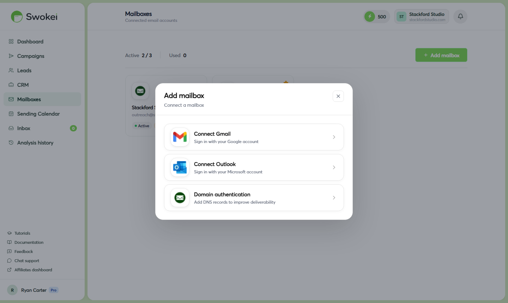

# Connecting via SMTP

SMTP connection works with any email provider—Gmail, Outlook, iCloud, Zoho, Fastmail, Yahoo, and custom domains hosted on cPanel or any standard hosting provider. Use SMTP when OAuth isn't available, your organization blocks OAuth, or you prefer not to grant OAuth permissions.

## What you need before starting

- Your full email address (e.g., ahmed@youragency.com)
- Your SMTP password—for providers with two-factor authentication, this is an App Password, not your regular login password (see provider-specific instructions below)
- Your provider's SMTP server hostname and port (Swokei auto-detects most common providers)
## Connecting via SMTP — step by step

- In the Swokei sidebar, click "Mailboxes".
- Click "Add mailbox". The "Connect a mailbox" modal opens.
- Click "Domain authentication". A form appears in the modal.
- Fill in the "Email address" field with your full email address (e.g., ahmed@youragency.com).
- Fill in the "Display name" field—this is the "From" name recipients will see in their inbox.
- Fill in the "Password" field. Use your regular email password, or an App Password if required by your provider (see below for provider-specific steps).
- Click "Detect settings". Swokei tries to automatically find your SMTP server hostname, port, and security type. This takes 3–5 seconds.
### If detection succeeds

A green box appears below showing the detected provider, SMTP host, port, and security type (e.g., "Gmail detected — smtp.gmail.com, port 465, SSL"). Review the settings and click "Connect mailbox". Swokei tests the connection. If successful, the modal closes and your mailbox appears in the Mailboxes list with a green "Connected" badge.

### If detection fails

A message says the settings couldn't be detected automatically. Click "Advanced settings" to expand a manual configuration form. Enter:

- SMTP host — the server hostname from your email provider (e.g., mail.yourdomain.com)
- SMTP port — usually 465 (SSL) or 587 (STARTTLS)
- Use SSL/TLS — toggle on for port 465, off for port 587
Click "Connect mailbox" to test and save.

## SMTP settings for common providers

## Gmail via SMTP — App Password required

Gmail doesn't allow your regular account password for SMTP connections. You must generate an App Password:

- Go to myaccount.google.com and sign in.
- Click "Security" in the left sidebar.
- Scroll to "How you sign in to Google" and click "2-Step Verification". (You must have 2-Step Verification enabled first.)
- Scroll to the bottom of the 2-Step Verification page and click "App passwords".
- In the "App name" field, type "Swokei" and click "Create".
- Google displays a 16-character password in a yellow box. Copy it immediately—you won't see it again after closing this dialog.
- Paste this 16-character password into Swokei's SMTP password field. Don't add spaces.
## Outlook / Microsoft 365 via SMTP — App Password required

If your Microsoft account has two-factor authentication enabled (standard on most accounts), you need an App Password for SMTP:

- Go to account.microsoft.com and sign in.
- Click "Security", then click "Advanced security options".
- Scroll to "App passwords" and click "Create a new app password".
- Microsoft generates a password and displays it on screen. Copy it immediately.
- Use this password in Swokei's SMTP password field instead of your regular Microsoft account password.
## iCloud Mail via SMTP — App-Specific Password required

Apple requires App-Specific Passwords for all third-party SMTP access when two-factor authentication is enabled (required on all modern Apple IDs):

- Go to appleid.apple.com and sign in.
- Click "Sign-In and Security", then "App-Specific Passwords".
- Click the "+" icon or "Generate an app-specific password".
- Enter a label—type "Swokei"—and click "Create".
- Apple displays the generated password. Copy it and use it in Swokei's SMTP password field.
- Use SMTP host smtp.mail.me.com, port 587, STARTTLS.
## After a successful connection

Once the connection test passes, the modal closes and your mailbox appears in the Mailboxes list with a green "Connected" badge labeled "SMTP". Click on the mailbox to open its settings drawer and configure your display name and email signature.

## When to use SMTP instead of OAuth

Use SMTP when:

- Your organization's IT policy blocks OAuth app authorization
- You're using a provider that doesn't support OAuth (Zoho, Fastmail, custom domains on cPanel, etc.)
- You have an on-premise Exchange server
- You prefer not to grant OAuth permissions for any reason
SMTP is slightly more work to configure but works with virtually any email provider that supports it.

## Understanding App Passwords

An App Password is a one-time password generated specifically for third-party applications like Swokei. When two-factor authentication is enabled, your real account password alone isn't sufficient—Gmail, Microsoft, and Apple require an App Password for SMTP connections as a security measure. You generate one in your account's security settings, then paste it into Swokei. The App Password is specific to Swokei and can be revoked anytime from your account settings.

## Is SMTP less reliable than OAuth?

SMTP is generally very reliable once configured. The main difference: OAuth connections automatically refresh their access tokens without any action from you, while SMTP credentials don't auto-refresh. SMTP credentials remain valid indefinitely unless you change your email password or revoke the App Password. If you do either, you'll see a connection error badge in Swokei and need to update the credentials. This is the primary trade-off compared to OAuth's automatic token management.

## Troubleshooting SMTP connections

### Error: "Authentication failed" or "Invalid credentials"

The most common cause. Work through these in order:

- If using Gmail, Outlook, or iCloud—you must use an App Password, not your regular login password
- Check for typos. Copy-paste the password rather than typing it manually
- Verify the email address is correct. Some providers use a different SMTP username format than the display email
### Error: "Connection refused" or connection timed out

- The SMTP host or port is likely wrong. Try the alternative port (swap 465 ↔ 587)
- Make sure the SSL/TLS toggle matches your port: SSL on for 465, SSL off for 587
- If you're on a corporate network, outbound SMTP may be blocked. Test from a different network or contact your IT team
### Error: "TLS handshake failed" or "SSL error"

You're using the wrong security setting for your port. Port 465 requires SSL on. Port 587 requires SSL off (it uses STARTTLS instead). Open Advanced settings and correct the toggle to match your port.

### Connection succeeds but emails go to spam

SMTP connection quality doesn't affect spam placement—that's determined by sender reputation and email authentication (SPF, DKIM, DMARC). See Staying out of the spam folder for a complete deliverability diagnostic guide.

ON THIS PAGE

