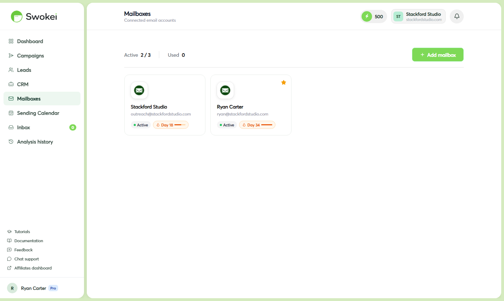

# Sending from Multiple Mailboxes

Running multiple mailboxes lets you scale campaigns, protect your sender reputation, and keep outreach moving if one address hits its daily limit. This guide explains why you'd want multiple mailboxes, how to set them up, and how to distribute campaigns across them.

## Why multiple mailboxes matter

Every email provider enforces daily sending limits. Gmail Workspace allows around 2,000 emails per day, personal Outlook around 300. If you want to contact 200 leads consistently, pushing all that volume through one address is risky. One spam complaint, one rate limit, one authentication hiccup—and everything stops.

With two or three mailboxes, you can:

- Distribute daily sends (e.g., 70 emails per mailbox for 200 total daily sends) and keep each address well below its limit
- Keep campaigns running if one address gets temporarily rate-limited or flagged
- Test different sender names or personas against similar audiences to see what resonates
- Isolate outreach by niche, region, or service so tracking and analysis stay clean
## How many mailbox slots your plan includes

- Free plan: 0 included—mailboxes are an add-on
- Basic plan: 1 included
- Pro plan: 2 included
Additional mailbox slots can be purchased as a monthly add-on at any time. There's no maximum—you can connect as many as you need for your operation.

## Adding a mailbox slot to your plan

- In the sidebar, click "Account".
- Click the "Billing" tab.
- Find the "Mailboxes" section and click "Add mailbox" or "Buy extra mailbox".
- Select how many additional slots you want and click "Buy now". The slots are added immediately.
- Go to Mailboxes and click "Add mailbox" to connect an email account to each new slot.
## Connecting a new mailbox

- In the sidebar, click "Mailboxes".
- Click "Add mailbox". The "Connect a mailbox" modal opens.
- Choose your provider (Gmail, Outlook, or SMTP) and complete the connection. For detailed steps, see the connection guide for your provider (e.g., Connecting a Gmail Account).
- After connecting, open the new mailbox's settings drawer and set a clear display name so you can easily identify it in campaign dropdowns (e.g., "Ahmed's Gmail" or "Agency Outreach 2").
- Enable warmup on the new mailbox by clicking the "Warmup" tab and clicking "Enable warmup". Don't run campaigns from a new mailbox until it's been warming for at least 2 weeks—just like a first mailbox.
## Assigning campaigns to specific mailboxes

Each campaign sends from exactly one mailbox. To distribute sends across multiple addresses, create separate campaigns and assign each to a different mailbox. This gives you full control over volume distribution:

- Create Campaign A and select Mailbox 1 from the "Send from" dropdown on the launch screen.
- Create Campaign B and select Mailbox 2 from the "Send from" dropdown.
- Both campaigns run simultaneously, each sending from its assigned mailbox.
You can target completely different audiences with each mailbox, or split the same audience into separate campaigns—whatever works for your strategy.

## Setting a default mailbox

If you have a preferred mailbox, set it as your default so it auto-selects for new campaigns:

- In the sidebar, click "Mailboxes".
- Click on the mailbox you want as default.
- In the settings drawer, toggle on "Set as default mailbox" and click "Save".
- New campaigns will pre-select this mailbox. You can still override it per campaign.
## Replies from all mailboxes go to the unified Inbox

Replies are routed to the mailbox that sent the original campaign—if Campaign A sent from a Gmail address, replies come back to that Gmail inbox. However, Swokei monitors all connected mailboxes and surfaces all replies in your unified Inbox page regardless of which mailbox received them. Campaign and mailbox details are shown on each reply card so you always know which conversation belongs to which campaign and sender.

## Best practices for managing multiple mailboxes

- Use different domains if possible. All your sending addresses sharing one domain (agency.com) means they share domain reputation—a reputation hit affects all of them. A dedicated outreach domain (agencyoutreach.com) isolates reputation issues to that domain alone.
- Warm each mailbox independently. A new address is cold regardless of how long your other mailboxes have been warming. Enable warmup on every new mailbox before using it in campaigns.
- Keep per-mailbox volume reasonable. Spreading 60–70 sends per day per mailbox is far safer than pushing 500 through one. This keeps you well below daily limits and minimizes your spam risk.
- Monitor warmup status for all mailboxes. Check the Warmup tab occasionally to ensure all addresses are progressing. A mailbox stuck at "Just started" is still too new for serious campaign volume.
## How to decide which leads go to which mailbox

Swokei doesn't automatically distribute leads across mailboxes—you control the assignment. The most practical approach: create separate campaigns for different audience segments (by industry, geography, niche, or service offering) and assign each campaign to a different mailbox. This keeps tracking clean, makes analysis straightforward, and lets you see which mailbox/audience combination performs best.

## What happens if a mailbox disconnects during a campaign

If a mailbox loses its authentication connection (token expiration, password change, or admin revocation), emails from that mailbox stop sending. The campaign doesn't auto-pause, but leads in the queue show as Failed. You'll see a red error badge on the mailbox in the Mailboxes list. Reconnect the mailbox to resume sending. For detailed troubleshooting, see the connection guide for your provider.

## Can multiple mailboxes target the same leads

Yes, but be strategic. If you send the same email to the same person from multiple mailboxes, it damages your reputation and increases your spam risk. Best practice: divide your lead list by segment (industry, location, interest) and assign each segment to a different mailbox. This way, leads receive outreach from one address only, and you can test which mailbox/message combination resonates best.

ON THIS PAGE

