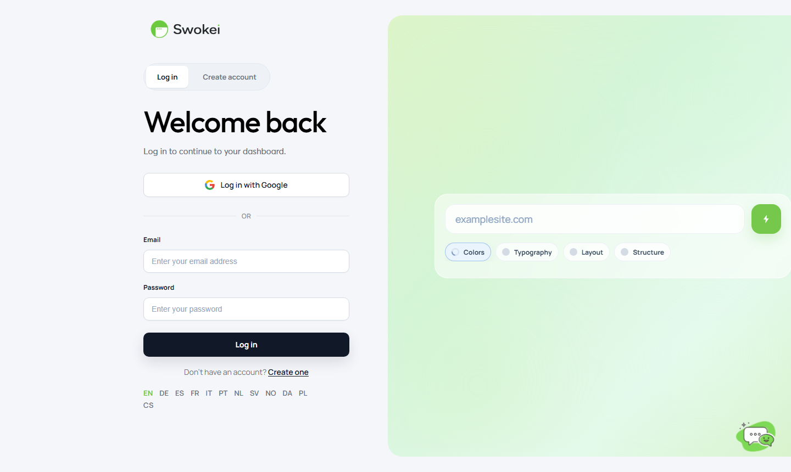

# Creating Your Account & Getting Started

A complete walkthrough of signing up for Swokei, verifying your email, completing onboarding, and connecting your first mailbox — everything you need before sending your first campaign.

## Sign up and create your account

Go to app.swokei.com and click the "Don't have an account? Sign up" link at the bottom of the login form.

Fill in three fields:

- Full name — your name as you want it to appear in your account
- Email address — this becomes your Swokei login and where we send notifications
- Password — must be at least 8 characters
Click the green "Create account" button. If any field has an error, a red message appears explaining what to fix.

## Verify your email address

After creating your account, Swokei sends a verification email to the address you provided. The subject line is something like "Verify your Swokei email address". Open it and click the "Verify my email" button inside.

Clicking that button opens a page in your browser confirming the verification was successful, and you're automatically logged in.

The verification link expires after 24 hours. If you didn't receive the email or the link expired:

- Log in at app.swokei.com with your email and password
- A banner at the top says "Please verify your email address" with a "Resend verification email" link. Click it.
- A new verification email is sent. Check your spam folder if it doesn't appear in your inbox within 2 minutes.
If you still don't receive the email after resending, check that you entered your email correctly during sign-up. If there's a typo, contact support to correct it.

## Complete the onboarding wizard

The first time you log in after verifying your email, Swokei shows a short onboarding wizard to configure some defaults.

### What do you do?

You'll be asked to describe your work — e.g., "Web design", "SEO", "Digital marketing", or "Other". Pick the one that best fits. Swokei uses this to set sensible defaults for your campaign tone and email templates.

### Who do you want to reach?

Next, you'll choose the types of businesses you typically pitch. Pick the closest match. You can update this later in Account → Profile — it's just a starting point to help Swokei configure better defaults.

### Your country

A dropdown asks for your country. This is used for regional formatting (date formats, language hints). Select your country and click "Continue".

On the final step, click "Get started" and you'll land on the dashboard. The wizard only appears once. If you skip or dismiss it, you can always update these preferences later at Account → Profile.

## Connect your first mailbox

Before running any campaigns, you need to connect at least one mailbox — the email account you'll send cold emails from. Click "Mailboxes" in the left sidebar.

The Mailboxes page shows "No mailboxes connected yet" with an "Add mailbox" button. Click it.

A modal appears titled "Connect a mailbox" with three options:

- Connect Gmail — use this for @gmail.com or a custom domain hosted on Google Workspace
- Connect Outlook — use this for @outlook.com, @hotmail.com, or work email on Microsoft 365
- Domain authentication (SMTP) — use this for iCloud, Zoho, Fastmail, cPanel, or any other provider
Click the option that matches your email provider:

- Gmail or Outlook: You'll be redirected to a Google or Microsoft login screen in a new window. Sign in with the email you want to connect and click "Allow" (Google) or "Accept" (Microsoft).
- SMTP: A form asks for your email address, display name, and password. Swokei attempts to auto-detect your SMTP settings. If successful, you'll see a green badge with the provider name. Click "Connect mailbox".
After connecting, the modal closes and your mailbox appears in the list with a green "Connected" badge. It's now ready to use in campaigns.

## Enable email warmup on your new mailbox

If you just connected a fresh email or one that hasn't been used for cold outreach before, enable warmup before running large campaigns. This gradual ramp-up of sending volume prevents your emails from landing in spam.

In the Mailboxes list, click on your newly connected mailbox to open its settings on the right side. Click the "Warmup" tab, then click "Enable warmup". Warmup starts immediately. The tab updates to show your current day (starting at 0), today's send count, and a status badge that says "Just started".

Let warmup run for at least 2–3 weeks before launching a large campaign. During warmup, you can still send campaigns — they'll just be sent gradually as your sender reputation builds.

## Your first campaign

With your mailbox connected and warmup running, you're all set. While warmup progresses in the background, a good next step is to create a small test campaign with 2–3 email addresses you control. This verifies the entire sending flow works before you put your real lead list in. See Running Your First Campaign for a step-by-step walkthrough.

## Change your email address later

If you need to change your Swokei login email after creating your account, go to Account → Profile, update the email field, and click Save. Swokei sends a verification link to the new address. Your old email stays active for login until you click the verification link in the new email, at which point it switches over.

ON THIS PAGE

