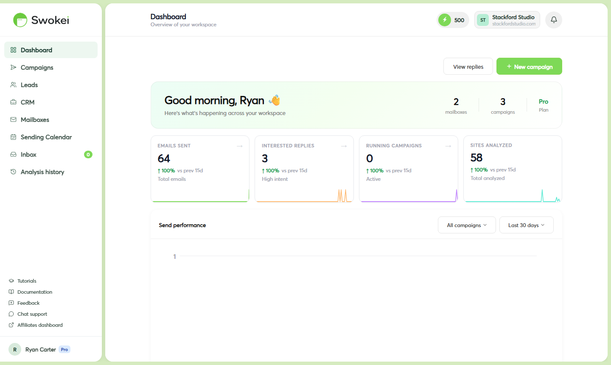

# Dashboard & App Overview

A complete walkthrough of every section in Swokei — what it does, where to find it, and when you'll use it as part of your daily workflow.

## Dashboard — your command center

The dashboard is the first page you see when you log in. It gives you a real-time overview of your account activity:

- Credit balance — how many credits you have left this period
- Active campaigns — how many campaigns are currently running and sending
- Unread replies — new replies that haven't been reviewed yet
- Interested replies — replies the AI classified as interested, waiting for your follow-up
- Recent activity feed — a live log of emails sent, replies received, and other campaign events
The dashboard is read-only — you can't take actions from here, but it's the quickest way to answer "what happened overnight?" and "what needs my attention today?" Check it every morning.

## Campaigns — where the work happens

This is where you spend most of your time. The Campaigns list shows all your campaigns (Draft, Running, Paused, or Completed) with stats like lead count, sent, replied, and failed.

Click into a campaign to see the full detail view:

- A sortable table of every lead with individual status (pending, sent, replied, failed)
- Stats cards showing overall sent, replied, failed, and pending counts
- An activity chart showing sends and replies over time
- The sequence editor for managing follow-up steps
- Campaign settings (sending mailbox, email tone, language, rules)
From the campaign detail view you can pause, resume, or delete a campaign. You can also add more leads to a running campaign without stopping it.

## Inbox — where deals start

A unified inbox for every reply from every campaign. When a prospect replies to your cold email, it appears here within a few minutes, automatically classified by AI as Interested, Not Interested, Auto-reply, Question, Unsubscribe, or Unclassified.

This is your most important page. The Inbox is where real sales work happens. From here you can:

- Read the full reply thread in context
- Override the AI's classification if it got it wrong
- Add CRM data: deal stage, notes, contact details, deal value
- Book a meeting and log the join link + time
- Mark the conversation as answered once you've replied
- Filter to show only Interested replies, only unread, or a specific campaign
Make it a daily habit to check Inbox every morning. Hot leads go cold fast if you don't respond quickly.

## Mailboxes — connect your sending accounts

This is where you connect and manage the email accounts you send campaigns from. Each mailbox shows its connection status, provider (Gmail, Outlook, SMTP), warmup status, and whether it's set as your default.

Click a mailbox to open its settings drawer with two tabs:

- General — display name, signature, set as default, delete option
- Warmup — toggle warmup on/off, current day, daily sent count, total sent, health status
If a mailbox shows an error badge (red warning icon), open it here to read the error and reconnect.

## Warmup — track sender reputation

A dedicated page showing the warmup health of all your connected mailboxes at a glance. Each mailbox card displays its current warmup day, daily send count, total emails sent, and health label (Just started, In progress, Good progress, Fully warmed, or Paused).

Use this page before launching campaigns to verify your mailboxes are actively warming. A mailbox on Day 5 shouldn't be running a 50-lead campaign yet — that risks going to spam.

## Leads — discover prospects

The built-in Lead Finder. Enter a city and industry to discover local businesses with their website and email address. Filter results, select the ones you want, and add them directly to an existing or new campaign.

The Leads section also stores a searchable archive of every contact you've ever imported into Swokei. You can see which campaigns they were part of and check their reply history without navigating into individual campaign views.

## CRM — track your pipeline

A pipeline table view of all leads that have entered some stage of the sales process. The CRM aggregates every lead with a set deal stage across all campaigns. Filter by:

- Deal stage (Contacted, Call booked, Proposal sent, Won, Lost)
- Campaign origin
- Date of last activity
- Deal value range
The CRM is the place to check when you want a big-picture view of your entire pipeline — not just stats from one campaign, but all active deals across everything you're running. From any lead's detail you can update notes, stage, contact info, and deal value.

## Sending Calendar — plan your sending

A calendar showing every email scheduled to go out — across all campaigns and all mailboxes — for the current month. Each day shows how many emails are scheduled, color-coded by campaign.

Use the Sending Calendar to:

- Verify emails are actually scheduled after launching a campaign
- Check if you're about to overload a specific mailbox on a particular day
- See gaps where no emails are going out (paused campaigns, weekends)
- View booked meetings from your CRM alongside your send schedule
## Analysis history — debug what went wrong

A log of every background operation Swokei has performed. This includes:

- Email send attempts (success and failure, with error messages)
- Website analysis jobs
- Reply sync tasks
- Warmup email sends
Analysis history is primarily a debugging tool. If something isn't working — emails not sending, website analysis failing, or replies not appearing — check here. Look for entries with a red "Failed" badge and read the error detail to understand what went wrong. Most errors are mailbox-related (auth expired, account suspended) and can be fixed by reconnecting in the Mailboxes section.

## Account settings — personal and team

All your personal and workspace settings, organized into tabs:

- Profile — name, email, password, language preference
- Workspace — company name, team size, location, website
- Membership — team members, pending invites, user roles
- Billing — current plan, credit balance, usage history, upgrade/downgrade, buy extra credits
- Payments — invoices and payment history
- Security — two-factor authentication setup, active sessions
- Notifications — control which events trigger in-app and email alerts
## Notifications — stay informed

The bell icon in the top navigation bar. Swokei sends in-app notifications for important events like:

- New Interested reply received
- Campaign completed (all leads processed)
- Mailbox disconnected or authentication error
- Credit balance running low
- Team member joined your workspace
Click the bell to open the notification panel. Unread notifications are highlighted. You can dismiss them one by one or mark all as read. Adjust which events trigger alerts in Account → Notifications.

## Your typical daily workflow

- Dashboard: Check the overnight summary, see if anything needs immediate attention
- Inbox: Review new replies, prioritize Interested ones, reply personally to hot leads
- Campaigns: Verify active campaigns are running, check for any failures
- CRM: Update deal stages for leads you've moved forward
The entire loop takes 10–15 minutes on a normal day. Swokei handles everything else in the background — sending, following up, tracking replies, and classifying them.

## Quick reference — where to find things

- Credit balance → top navigation bar (always visible)
- Unread replies → Inbox (red badge count on Inbox in sidebar)
- Active campaigns → Campaigns list
- Mailbox health → Mailboxes → click a mailbox → Warmup tab
- Send errors and failures → Analysis history (in sidebar)
- Full pipeline / all deals → CRM
- Upcoming emails scheduled → Sending Calendar
- Billing, plan, and credits → Account → Billing tab
- Team members and invites → Account → Membership tab
ON THIS PAGE

