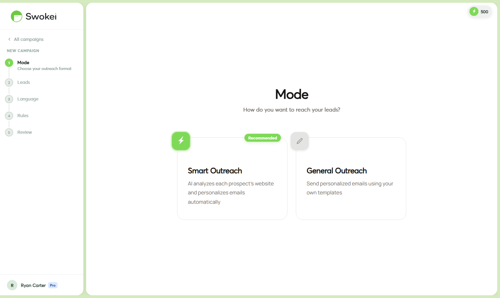

# Running Your First Campaign

This guide walks you through everything — from choosing a campaign type, to uploading your first leads, to what to do when the first replies land. Plan for about 15 minutes to set up and launch.

## Before you start — the pre-launch checklist

Your first campaign needs two things in place before you click launch. Skip either and the campaign won't be able to send.

- A connected mailbox — go to Mailboxes and connect at least one Gmail or Outlook account. If you just connected it, it's fine to launch — warmup runs in parallel with campaigns.
- A lead list — a CSV or Google Sheet with at minimum an email address and a website URL for each lead. Name and company are helpful but optional.
You also need credits if you're running a Smart Outreach. Check your balance in the top navigation bar. A typical first campaign of 20–50 leads costs 20–50 credits.

## Step 1 — Choose your campaign type

In the sidebar, click "Campaigns", then click "+ New campaign". A modal appears asking you to choose between two types.

### Smart Outreach — recommended for first campaigns

Swokei visits each prospect's website, scores it across 6 dimensions (design, SEO, mobile, performance, trust, content), and writes a personalized cold email referencing specific issues it found. Every email is unique to that lead. This is what gives cold outreach a genuinely high reply rate — the email is about their actual website, not a generic pitch.

Cost: 1 credit per lead. The email and all follow-ups are sent for free.

### General Outreach — for when you write the email yourself

You write one email, upload leads, and Swokei sends it at scale. No website analysis happens, no credits are used. Good for re-engagement campaigns, fixed-price service promotions, or any message that doesn't depend on a website audit.

## Step 2 — Upload your leads

After choosing a campaign type, the wizard opens at the Leads step. You have three options:

- Upload CSV — drag and drop or browse a file. The file needs at minimum columns for email address and website URL. After uploading, you map the columns (Swokei shows a preview and asks which column is the email, which is the website, etc.).
- Connect Google Sheet — paste the URL of a Google Sheet. Swokei reads directly from it. The same column mapping step applies.
- Lead Finder — search by city and industry directly in Swokei and add those results to this campaign.
For your first campaign, start with 20–50 leads, not 500. Small batches let you validate that everything is working and that the generated emails look good before you scale up.

## Step 3 — Writing (language selection)

This step lets you choose the language Swokei writes the emails in. The default is English. If you're targeting local businesses in a specific market, select that language here. Swokei generates the email body and subject line in whichever language you pick.

The language setting also affects subject line style and cultural tone — Norwegian emails, for example, tend to be more direct and less formal than US English cold emails.

## Step 4 — Rules

Rules let you control which leads get emailed and what angle the AI takes:

- Minimum website score — if a site scores above this threshold (e.g. 7/10), skip it. Sites that are already well-built have less obvious problems to pitch against. A threshold of 6 is a reasonable starting point.
- Unreachable sites — what to do when Swokei can't access a site. "Skip" is the safe default. "Email anyway without analysis" sends a more generic email to those leads.
- Email goal — this is the most important setting. It shapes what the AI asks for at the end of every email:
Start a conversation — a low-friction open-ended ask ("Would this be worth a quick look?"). Best for cold outreach to strangers. Gets the highest reply rates.
Free mockup/audit — offer a free sample of your work as the call to action. Works well if you have a strong portfolio.
Discovery call — ask directly for a meeting. Higher commitment ask, lower reply rate, but more qualified when they do reply.
- Start a conversation — a low-friction open-ended ask ("Would this be worth a quick look?"). Best for cold outreach to strangers. Gets the highest reply rates.
- Free mockup/audit — offer a free sample of your work as the call to action. Works well if you have a strong portfolio.
- Discovery call — ask directly for a meeting. Higher commitment ask, lower reply rate, but more qualified when they do reply.
## Step 5 — Review

Name your campaign something you'll recognize later (e.g. "Denver Restaurants May 2026") and write your subject line. The subject line is the same for all emails in a Smart Outreach — it's the hook that gets the email opened, while the body is personalized per lead.

Good subject lines for cold outreach are short, specific, and conversational. Avoid anything that looks like marketing. Examples that work:

- "Quick question about [domain]"
- "noticed something on your site"
- "your website — worth a quick look?"
## Step 6 — Launch

Select which mailbox to send from. If you only have one connected, it's pre-selected. Click "Launch campaign". Swokei immediately begins analyzing websites in the background.

## What happens after you launch

Once launched, Swokei processes your lead list in order:

- Each lead enters a website analysis queue. Analysis typically completes within a few minutes per lead, but for larger batches it can take up to an hour.
- Once analyzed, the AI generates a personalized email for that lead. The lead status changes from Pending to Ready.
- Ready leads are sent according to your mailbox's daily sending schedule. Sends are distributed across the day, not all at once.
- If a lead replies, all follow-ups for that lead stop automatically. The reply appears in your Inbox page, classified by the AI.
## How long until the first send?

For a 20-lead campaign, expect the first emails to go out within 30–60 minutes of launching. Analysis happens fast, and Ready leads are sent throughout the day. By the following morning, all 20 emails should be out.

## Common mistakes on a first campaign

- Leads with no website URL. Swokei can't analyze what doesn't exist. Make sure your CSV has a website column.
- Subject line that looks like marketing. "We can improve your website performance!" gets ignored. "noticed a few things on your site" gets opened.
- Too many leads at once. Start small. 20 leads gives you enough data to see what the emails look like and how people respond before you run 500.
- Mailbox not warmed up. A brand-new email address sending cold outreach on day 1 will land in spam. Enable warmup first and let it run for at least 2 weeks before campaigns.
- Deleting instead of pausing. If something looks wrong, pause the campaign — don't delete it. You can't get back a deleted campaign and the credits are already spent.
## Reviewing your results

Once emails start going out, check the campaign detail page daily. Look at:

- Reply rate — 1–3% is average for cold outreach. 3–6% is good. If you're at 0% after 30+ sends, the subject line or email goal needs adjustment.
- Inbox — check every morning for new replies. Reply quickly to Interested leads — the first 24 hours after a reply are when conversion is highest.
- Failed leads — hover over the Failed badge to see the error. "Invalid email address" means bad data in your list. "Mailbox rate limit" means your mailbox hit its daily cap.
ON THIS PAGE

