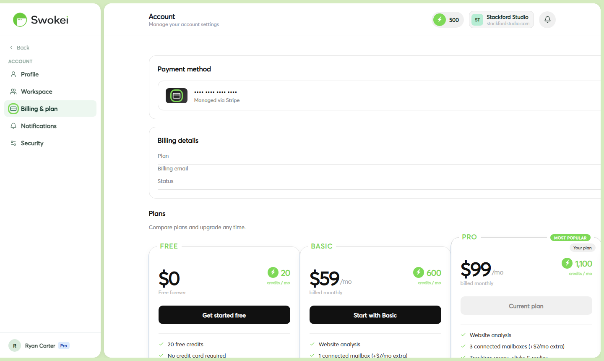

# Understanding Credits

Credits are Swokei's usage currency. Every time the AI analyzes a website and generates a personalized email, it costs one credit. This guide explains how credits work, how they're refilled, and how to make them go further.

## What uses a credit?

One credit is consumed when Swokei successfully:

- Fetches and analyzes a prospect's website
- Generates a personalized cold email based on the analysis
These always happen together — one lead = one credit. If the analysis fails (website is down, blocked, or has no usable content), no credit is charged for that lead.

### What does NOT use credits

- Sending the email (sending is included — no extra cost)
- Follow-up emails being sent
- Reply classification
- CRM features, calendar, site preview generation
- Browsing or searching leads in the lead finder
## Credit allocations by plan

## How rollover works

At the start of each new billing period, Swokei adds your monthly credit allocation to your account. Any unused credits from the previous month roll over, up to a maximum of one full monthly allocation.

### Example (Basic plan, 600 credits/month)

- Month 1: You receive 600 credits, use 400. You carry over 200.
- Month 2: You receive another 600. Balance = 800. Maximum rollover cap = 600, so your balance becomes 800 (you're still under the cap of 600 rollover + 600 new = 1,200 possible max).
- If you had used 0 credits in Month 1, your Month 2 starting balance would cap at 1,200 (600 rolled + 600 new).
## Bonus credits

Swokei occasionally awards bonus credits for:

- Referring another user who upgrades
- Promotional events or early-access programs
- Support resolutions where something went wrong
Bonus credits are separate from your monthly allocation and don't affect rollover calculations.

## Buying extra credits

If you run out of credits before your billing period renews, you can buy a top-up from Account → Billing & plan. Extra credits are available in several bundle sizes and never expire while your account is active.

## Checking your credit balance

Your current balance is always visible in the top navigation bar. For a full history of credit usage — which campaigns used credits, when, and how many — go to Account → Billing & plan → Credit history.

## How many credits do I need?

A simple rule: the number of credits you need equals the number of leads you want to contact per month via Smart Outreach. 50 leads = 50 credits. 500 leads = 500 credits. Use this to pick the right plan:

- Free (20 credits): Testing and validation. Enough for a first campaign to see how Swokei works.
- Basic (600 credits): ~20–30 leads per day, 5 days a week. Suitable for a solo operator running consistent outreach.
- Pro (1,100 credits): ~50 leads per day. Suitable for an agency with multiple active campaigns running in parallel.
## Do credits expire?

No — as long as your subscription is active, your credits don't expire. Rolled-over credits accumulate and stay available until used. If you cancel your subscription, any remaining credits are no longer accessible.

## What happens if I downgrade my plan?

If you downgrade to a lower plan, your rollover balance is capped to match the new plan's rollover limit. For example, if you're on Pro (1,100 credits/month) with 900 rolled credits and downgrade to Basic (600 credits/month), your rollover cap becomes 600 — the excess 300 rolled credits would be trimmed. Your new monthly allocation switches immediately to the lower plan's amount.

## Do team members share my credits?

Yes. Credits are tied to the workspace owner's account. Any campaign launched by any team member draws from the same credit pool. If you have multiple people running campaigns in the same workspace, the credit usage accumulates collectively. Monitor the credit history (Account → Billing & plan → Credit history) to see which campaigns and which members are using the most credits.

## Can I get a refund if analysis fails?

Yes — a credit is only charged when analysis succeeds and an email is generated. If Swokei can't reach a website (offline, blocked, invalid URL), the lead is marked Skipped and no credit is deducted. You're never charged for failed analysis.

## Tips for getting the most from your credits

- Clean your list first. Remove obviously bad emails and dead domains before running analysis. You don't want to spend credits on leads that bounce immediately after sending.
- Use the website score filter. Set a minimum score threshold (e.g. 6) in the campaign Rules step to skip leads with well-built sites. High-scoring sites have less obvious problems to pitch against and are lower-probability prospects.
- Start small. Run 20–50 leads on your first campaign to validate everything looks right before spending 500 credits at once.
- Pause, don't delete. If you want to stop a campaign temporarily, pause it. Deleting a campaign doesn't refund credits already spent on analysis.
- Use rollover deliberately. If you know you'll have a high-volume month coming up, run fewer campaigns now and let credits accumulate. Rollover gives you a buffer for peak periods.
ON THIS PAGE

