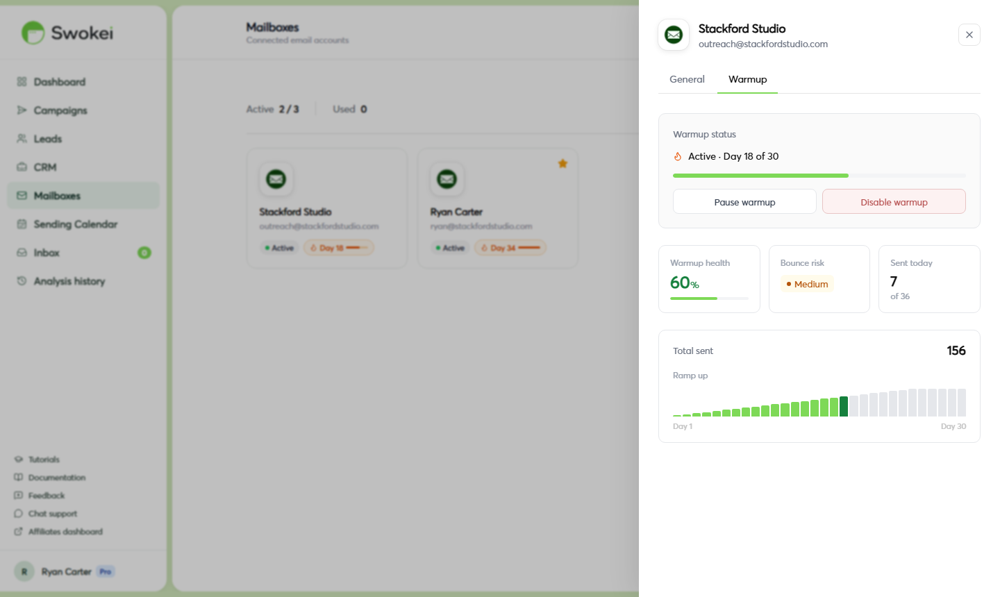

# Emails Going to Spam

If your prospects aren't replying and you suspect spam filtering, this guide walks you through how to confirm it, diagnose the cause, and fix it — in that order.

## Step 1 — Confirm emails are actually landing in spam

- Send a test email from your campaign mailbox to a personal address you control on a different provider (e.g. send from Gmail to Outlook, or vice versa).
- Check whether it lands in your inbox or spam folder.
- For a more detailed score, go to mail-tester.com, copy the test address they give you, send an email to that address from your campaign mailbox, then click "Then check your score". The report shows exactly what's causing spam flags.
## Step 2 — Find the cause

Work through these in order from most likely to least likely.

### Cause 1: Mailbox not warmed up

This is the most common cause. A new or dormant address sending cold emails without warmup will get filtered almost immediately. Check the Warmup page — in the sidebar, click "Warmup" and look at the health status for your sending mailbox. If it says "Just started" or "In progress", warmup hasn't run long enough. See Email Warmup Guide.

### Cause 2: Missing email authentication (SPF, DKIM, DMARC)

Without proper DNS records, inbox providers have no way to verify your emails are legitimate. Check your setup:

- Go to mxtoolbox.com/SuperTool.aspx.
- Enter your sending domain (the part after the @ in your email address).
- Run the SPF Record Lookup, DKIM Lookup, and DMARC Lookup checks.
- If any of them show errors or "none found", those records need to be added in your domain's DNS settings.
If you connected via Gmail or Outlook OAuth, SPF and DKIM are configured automatically by Google/Microsoft. If you connected via SMTP on a custom domain, you need to set them up manually in your domain registrar's DNS panel.

### Cause 3: High bounce rate from a bad lead list

Too many undeliverable addresses (hard bounces) in a short window signals spam to providers. Check your lead list for obviously invalid addresses — role accounts like info@ and noreply@, domains that no longer exist, and addresses with typos.

### Cause 4: Sending too much too fast

Even a fully warmed address shouldn't jump from zero to 500 emails overnight. Check the Sending Calendar — if you see a day with a very high send count relative to previous days, that spike may have triggered filtering. Spread volume gradually when scaling up a new campaign. If your emails were working fine and then suddenly started going to spam, common causes include a spike in unsubscribe or complaint rates (too many people marked your email as spam), an abrupt increase in volume, a mailbox authentication issue (DKIM/SPF broke when a DNS change was made), or your domain landing on a blacklist. Run mail-tester.com first — it will identify the specific issue.

### Cause 5: Spam trigger words in the email content

Check your email for: "guaranteed", "no risk", "act now", "100% free", "click here", "earn money", excessive exclamation points, or all-caps words. These reliably trip spam filters. Swokei's AI-generated emails are designed to avoid them, but check any custom emails you've written in General Outreach campaigns.

### Cause 6: Domain reputation is already damaged

If you've sent high volumes from this domain before without warmup, the domain's reputation may already be poor. Check your domain at Google Postmaster Tools (for Gmail deliverability) and Microsoft SNDS (for Outlook). A "bad" domain reputation rating means recovery will take weeks of careful, low-volume, high-quality sending.

## Step 3 — Fix it

Once you've identified the cause, follow these steps to recover:

- Pause all campaigns from the affected mailbox immediately. In the Campaigns list, click each campaign and click "Pause Campaign". Do not keep sending while you fix the issue — more spam signals make recovery slower.
- Fix the root cause — add missing DNS records, clean your lead list, or wait for warmup to progress further.
- Let the mailbox rest for 7–14 days with warmup running but no campaign emails.
- Restart with low volume — re-launch campaigns at 10–15 emails per day and increase gradually over 2–3 weeks.
- Monitor your spam rate at Google Postmaster Tools as you scale back up.
## If the domain is too damaged to recover

In severe cases — typically from large-volume sending without any warmup — domain reputation damage is extensive enough that recovery isn't practical. In this situation:

- Register a new sending domain specifically for outreach (e.g. agencyname-mail.com or agencyname-outreach.com).
- Set up email hosting on the new domain (Google Workspace works well).
- Connect the new address to Swokei and start a full warmup from day 1.
- Run warmup for the full 30 days before any campaigns.
## Handling feedback when a prospect reports spam

If a prospect tells you your email went to their spam folder, don't panic — one spam placement isn't a crisis. Act on it immediately: run a deliverability test at mail-tester.com, check that SPF/DKIM/DMARC are set up for your sending domain, review the content of that specific email for spam-trigger words, and check your mailbox's warmup status. If the issue is isolated (one recipient, one provider), it may be that recipient's email provider being unusually aggressive. If multiple people report it, you have a systemic deliverability issue that needs fixing before continuing campaigns. Pause the affected campaign while you investigate.

ON THIS PAGE

