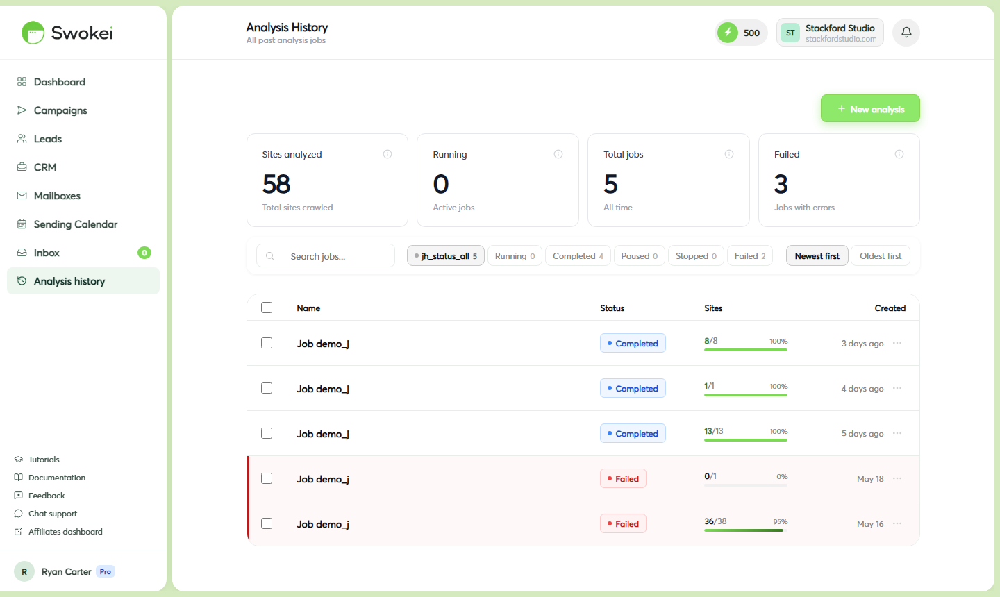

# My Campaign Isn't Sending

If your campaign is active but emails aren't going out, or if they started and then stopped, work through these checks in order. Most issues have one of a handful of root causes — and you can fix most of them yourself in under five minutes.

## Check 1 — Is the campaign actually paused?

This is the most common cause. Go to Campaigns in the sidebar and look at the status badge next to your campaign name. If it says "Paused" (shown in yellow or grey), that's why nothing is sending.

Click on the campaign to open it, then click the green "Resume" button at the top of the page. The badge changes to "Running" and sending restarts.

## Check 2 — Is the sending mailbox connected?

In the sidebar, click "Mailboxes". Look at every mailbox in the list. A connected, working mailbox shows a green "Connected" badge. A mailbox with a problem shows a red or yellow warning icon or badge.

If you see a warning on the mailbox assigned to your campaign:

- Click on that mailbox to open its settings drawer.
- Near the top of the drawer you'll see an error message describing what's wrong — something like "Authentication expired — reconnect required" or "Connection failed".
- Click the "Re-authorize" button (shown in red or orange). For Gmail/Outlook, a pop-up window opens — complete the OAuth flow again. For SMTP, a form appears — re-enter your password.
- Once reconnected, the badge turns green. Go back to your campaign and resume it if it was paused.
## Check 3 — Have you run out of credits? (Smart Outreachs only)

Smart Outreachs need credits to analyze leads and generate emails. If your credit balance hits 0, new leads can't be processed.

Look at the credit counter in the top navigation bar. If it shows 0, that's the issue. To fix it:

- Wait for your billing period to renew — credits are topped up automatically at the start of each new period.
- Or buy a credit top-up immediately: go to Account in the sidebar, click the "Billing" tab, and look for the "Buy credits" or "Top up" option. Select a bundle size and complete the purchase. Credits are added to your account instantly.
## Check 4 — Are leads stuck in "Ready" but not moving?

Open the campaign detail page. If leads show a "Ready" status badge but aren't changing to "Sent", several things could be causing it:

### Daily sending limit reached

Your mailbox has a limit on how many emails can go out in one day (Gmail Workspace: ~2,000/day, free Gmail: ~500/day, personal Outlook: ~300/day). Once the daily limit is hit, sending pauses until midnight and then resumes automatically. Check the Sending Calendar — if today's column is full, this is the cause. No action needed; sending resumes tomorrow.

### Silent mailbox error

The mailbox might show "Connected" but have a token issue that only surfaces when actually attempting to send. Go to Mailboxes, click on the mailbox, and look for any error text inside the drawer even if the badge looks okay. If you're not sure, click "Re-authorize" anyway to refresh the token — it takes 30 seconds and often fixes intermittent sending issues.

### Campaign processing is still in progress

For large campaigns (100+ leads), website analysis and email generation can take 20–40 minutes to complete for all leads. Leads that haven't been analyzed yet won't have emails generated and won't appear as Ready. Wait a bit and refresh the page — you should see more leads moving into Ready and then Sent status over time. For a small campaign (20–50 leads), expect the first emails to go out within 30–60 minutes of launching — analysis runs quickly and Ready leads are sent throughout the day.

## Check 5 — Are all leads showing "Failed" or "Skipped"?

### All leads show "Failed"

This almost always means the mailbox couldn't authenticate at send time. Open the mailbox in the Mailboxes page and look for an error. Click "Re-authorize" to reconnect, then on the campaign detail page click the "Retry failed" button that appears when there are failed leads, or click an individual failed lead to retry it from the lead detail panel.

### All leads show "Skipped"

Skipped means website analysis failed for every lead. Common causes:

- The website URLs in your CSV are invalid (missing domain, typos, wrong format)
- Every site in the list happens to be down or blocking crawlers (rare but possible for a niche list)
- The CSV was mapped incorrectly and the "Website" column actually contains non-URL data
Open a few skipped leads and hover over the "Skipped" badge to read the specific error reason. Then check your original CSV and correct any URL format issues.

## Check 6 — Look at Analysis history

In the sidebar, click "Analysis history". This page logs every background task Swokei has run — send attempts, analysis jobs, reply syncs — with a status (success or failed) and, for failures, an error message.

Filter by the campaign name or the mailbox email address. If you see a pattern of failures with a specific error message, that error message is usually the clearest indicator of what's wrong. If your campaign shows "Running" but nothing has sent in days, check Analysis history first — the most likely causes are a mailbox authentication loss (visible as red badges in Mailboxes), all leads stuck in analysis (check for errors), or a billing/credit issue for Smart Outreaches with zero credits. Running status means the campaign hasn't been paused — it doesn't guarantee sends are happening.

ON THIS PAGE

