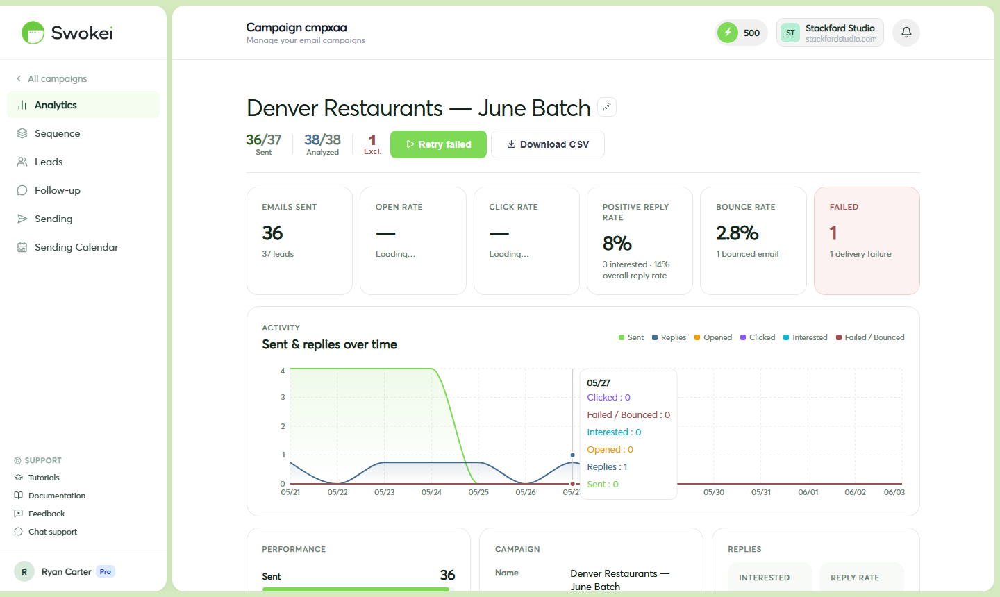

# Site Preview: Website Redesign Concepts

The Site Preview feature generates a fully rendered website redesign concept for any prospect — built specifically around their business name, industry, and location. You can share the link in your cold email to show the prospect what a better version of their website could look like before they've agreed to anything.

## Why Site Preview works

Cold outreach typically suffers from one problem: it's all talk. "We can build you a better website" is a claim any agency can make. Showing up with a working concept built specifically for their business is a completely different conversation starter.

When a prospect clicks a link and sees a polished website concept with their business name, their services, and their location — done in a modern design — it answers the question "can these people actually do the work?" before they even have to ask it. This is why campaigns that include a Site Preview link consistently outperform those without one.

## How to generate a Site Preview

Open any campaign and find a lead in the lead table. Click on the lead row to expand its detail panel on the right. In the lead detail panel, look for the "Generate site preview" button and click it. A small modal opens asking you to choose a design template — three options are available:

- Modern Service — clean, minimal aesthetic. Works well for professional services (accountants, consultants, agencies themselves).
- Premium Corporate — bold, polished look. Good for B2B companies, financial services, technology firms.
- Local Business — warm, approachable design. Best for local businesses like restaurants, clinics, tradespeople, and retailers.
Click the template that best fits the prospect's business type, then click "Generate preview". The modal closes. In the lead detail panel, the Site Preview section now shows a status badge reading "Generating" (usually 5–20 seconds). When generation completes, the status changes to "Ready" and a preview URL appears below it (e.g., swokei.com/p/abc123).

## Understanding preview generation status

In the lead detail panel, the Site Preview section shows one of these statuses:

- Not generated — no preview has been requested for this lead yet
- Queued — generation is waiting in the queue (usually happens during high-volume periods)
- Generating — being built right now (5–20 seconds)
- Ready — done, the preview URL is available to copy
- Failed — generation failed. This usually happens when the lead's existing site has very little content for the AI to work from. You can click "Retry" to try again with a different template.
## Copying and sharing the preview link

Once the preview is ready, click the "Copy link" button next to the preview URL. The URL is copied to your clipboard and can be pasted into the generated cold email (edit the email in the campaign and add the link), a follow-up email you write manually, a LinkedIn message, or any other outreach channel. The link is public — anyone with it can view the preview without logging in, making sharing frictionless for prospects.

## What the preview shows to your prospect

When a prospect opens the link, they see a full webpage — a designed homepage concept built around their business. It includes their business name in the navigation and hero section, a headline and description tailored to their industry and services (pulled from the AI analysis of their existing site), their city and location context woven into the copy where relevant, a modern visual design using the selected template style, and sections like services, about, testimonials, and contact populated with realistic placeholder content. The preview is a full-page design concept that works and scrolls like a real website, not a screenshot or wireframe.

## Framing the preview in your email

The most effective way to use Site Preview is to mention it naturally in the email — make the prospect curious before they click, not obligated. For example:

Or as part of a follow-up after the initial email:

## When previews fail to generate

If a site preview fails to capture, the lead will still have analysis data and a generated email — the preview is a supplementary visual aid, not required for the campaign to function. Sites that block screenshot tools, use heavy JavaScript rendering, or are behind login walls may not generate clean previews. In these cases, you can try again with a different template, or simply proceed without the visual element. The personalized email from the website analysis will still be compelling on its own.

ON THIS PAGE

